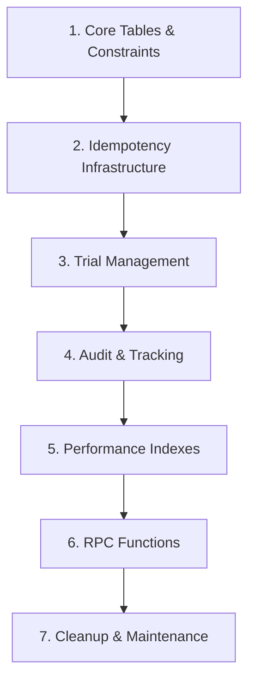

# Database Migrations for Production-Ready Checkout

## Overview
These migrations address all database-level issues identified in the checkout flow analysis. Apply them in order to ensure referential integrity.

---

## Migration Order & Dependencies



---

## 1. Core Tables & Unique Constraints

### Migration: 001_add_unique_constraints.sql

```sql
-- Prevent duplicate active subscriptions for same product
ALTER TABLE subscriptions
ADD CONSTRAINT unique_active_subscription
UNIQUE (customer_id, product_id, status)
WHERE status IN ('active', 'trialing');

-- Prevent duplicate customers per organization
ALTER TABLE customers
ADD CONSTRAINT unique_customer_email_per_org
UNIQUE (organization_id, email);

-- Prevent duplicate external IDs
ALTER TABLE customers
ADD CONSTRAINT unique_external_id_per_org
UNIQUE (organization_id, external_id)
WHERE external_id IS NOT NULL;

-- Prevent duplicate feature grants
ALTER TABLE feature_grants
ADD CONSTRAINT unique_feature_grant
UNIQUE (customer_id, feature_id, subscription_id)
WHERE subscription_id IS NOT NULL;

-- Add check constraints for data integrity
ALTER TABLE subscriptions
ADD CONSTRAINT check_subscription_dates
CHECK (current_period_start <= current_period_end);

ALTER TABLE subscriptions
ADD CONSTRAINT check_trial_dates
CHECK (trial_start IS NULL OR trial_end IS NULL OR trial_start <= trial_end);

ALTER TABLE subscriptions
ADD CONSTRAINT check_positive_amount
CHECK (amount >= 0);

ALTER TABLE payment_intents
ADD CONSTRAINT check_positive_payment_amount
CHECK (amount > 0);

-- Add missing columns
ALTER TABLE subscriptions
ADD COLUMN IF NOT EXISTS product_version_id UUID,
ADD COLUMN IF NOT EXISTS price_version_id UUID,
ADD COLUMN IF NOT EXISTS original_created_at TIMESTAMPTZ DEFAULT NOW();

-- Add foreign key constraints with proper cascading
ALTER TABLE subscriptions
DROP CONSTRAINT IF EXISTS subscriptions_customer_id_fkey,
ADD CONSTRAINT subscriptions_customer_id_fkey
  FOREIGN KEY (customer_id)
  REFERENCES customers(id)
  ON DELETE RESTRICT; -- Don't allow customer deletion with active subscriptions

ALTER TABLE feature_grants
DROP CONSTRAINT IF EXISTS feature_grants_subscription_id_fkey,
ADD CONSTRAINT feature_grants_subscription_id_fkey
  FOREIGN KEY (subscription_id)
  REFERENCES subscriptions(id)
  ON DELETE CASCADE; -- Delete grants when subscription deleted
```

### Rollback: 001_rollback.sql
```sql
ALTER TABLE subscriptions DROP CONSTRAINT IF EXISTS unique_active_subscription;
ALTER TABLE customers DROP CONSTRAINT IF EXISTS unique_customer_email_per_org;
ALTER TABLE customers DROP CONSTRAINT IF EXISTS unique_external_id_per_org;
ALTER TABLE feature_grants DROP CONSTRAINT IF EXISTS unique_feature_grant;
ALTER TABLE subscriptions DROP CONSTRAINT IF EXISTS check_subscription_dates;
ALTER TABLE subscriptions DROP CONSTRAINT IF EXISTS check_trial_dates;
ALTER TABLE subscriptions DROP CONSTRAINT IF EXISTS check_positive_amount;
ALTER TABLE payment_intents DROP CONSTRAINT IF EXISTS check_positive_payment_amount;
ALTER TABLE subscriptions DROP COLUMN IF EXISTS product_version_id;
ALTER TABLE subscriptions DROP COLUMN IF EXISTS price_version_id;
ALTER TABLE subscriptions DROP COLUMN IF EXISTS original_created_at;
```

---

## 2. Idempotency Infrastructure

### Migration: 002_idempotency_tables.sql

```sql
-- Create idempotency keys table
CREATE TABLE IF NOT EXISTS idempotency_keys (
  id UUID PRIMARY KEY DEFAULT gen_random_uuid(),
  key VARCHAR(255) NOT NULL UNIQUE,
  request_hash VARCHAR(64) NOT NULL,
  request_params JSONB NOT NULL DEFAULT '{}',
  response JSONB,
  status VARCHAR(50) NOT NULL DEFAULT 'pending'
    CHECK (status IN ('pending', 'processing', 'completed', 'failed')),
  organization_id UUID REFERENCES organizations(id) ON DELETE CASCADE,
  created_at TIMESTAMPTZ DEFAULT NOW(),
  updated_at TIMESTAMPTZ DEFAULT NOW(),
  expires_at TIMESTAMPTZ DEFAULT NOW() + INTERVAL '24 hours',
  error_message TEXT,
  retry_count INTEGER DEFAULT 0
);

-- Indexes for performance
CREATE INDEX idx_idempotency_keys_key ON idempotency_keys(key) WHERE status != 'expired';
CREATE INDEX idx_idempotency_keys_expires ON idempotency_keys(expires_at) WHERE status != 'expired';
CREATE INDEX idx_idempotency_keys_org ON idempotency_keys(organization_id);
CREATE INDEX idx_idempotency_keys_status ON idempotency_keys(status);

-- Add idempotency tracking to existing tables
ALTER TABLE checkout_sessions
ADD COLUMN IF NOT EXISTS idempotency_key VARCHAR(255),
ADD CONSTRAINT fk_checkout_idempotency
  FOREIGN KEY (idempotency_key)
  REFERENCES idempotency_keys(key);

ALTER TABLE subscriptions
ADD COLUMN IF NOT EXISTS idempotency_key VARCHAR(255),
ADD CONSTRAINT fk_subscription_idempotency
  FOREIGN KEY (idempotency_key)
  REFERENCES idempotency_keys(key);

-- Cleanup function for expired keys
CREATE OR REPLACE FUNCTION cleanup_expired_idempotency_keys()
RETURNS INTEGER AS $$
DECLARE
  deleted_count INTEGER;
BEGIN
  DELETE FROM idempotency_keys
  WHERE expires_at < NOW()
    AND status NOT IN ('processing');

  GET DIAGNOSTICS deleted_count = ROW_COUNT;
  RETURN deleted_count;
END;
$$ LANGUAGE plpgsql;
```

### Rollback: 002_rollback.sql
```sql
ALTER TABLE checkout_sessions DROP COLUMN IF EXISTS idempotency_key;
ALTER TABLE subscriptions DROP COLUMN IF EXISTS idempotency_key;
DROP TABLE IF EXISTS idempotency_keys CASCADE;
DROP FUNCTION IF EXISTS cleanup_expired_idempotency_keys();
```

---

## 3. Trial Management

### Migration: 003_trial_tracking.sql

```sql
-- Create trial history table
CREATE TABLE IF NOT EXISTS trial_history (
  id UUID PRIMARY KEY DEFAULT gen_random_uuid(),
  customer_id UUID NOT NULL REFERENCES customers(id) ON DELETE CASCADE,
  product_id UUID NOT NULL REFERENCES products(id),
  trial_start TIMESTAMPTZ NOT NULL,
  trial_end TIMESTAMPTZ NOT NULL,
  subscription_id UUID REFERENCES subscriptions(id) ON DELETE SET NULL,
  converted BOOLEAN DEFAULT FALSE,
  conversion_date TIMESTAMPTZ,
  cancellation_reason TEXT,
  metadata JSONB DEFAULT '{}',
  created_at TIMESTAMPTZ DEFAULT NOW(),
  updated_at TIMESTAMPTZ DEFAULT NOW(),
  UNIQUE(customer_id, product_id) -- One trial per product per customer
);

-- Indexes for trial queries
CREATE INDEX idx_trial_history_customer ON trial_history(customer_id);
CREATE INDEX idx_trial_history_product ON trial_history(product_id);
CREATE INDEX idx_trial_history_dates ON trial_history(trial_start, trial_end);
CREATE INDEX idx_trial_history_converted ON trial_history(converted) WHERE converted = true;

-- Track email variations to prevent abuse
CREATE TABLE IF NOT EXISTS customer_email_variants (
  id UUID PRIMARY KEY DEFAULT gen_random_uuid(),
  customer_id UUID NOT NULL REFERENCES customers(id) ON DELETE CASCADE,
  email VARCHAR(255) NOT NULL,
  email_normalized VARCHAR(255) NOT NULL, -- Without + parts and dots
  email_domain VARCHAR(255) NOT NULL,
  created_at TIMESTAMPTZ DEFAULT NOW(),
  UNIQUE(email)
);

CREATE INDEX idx_email_variants_normalized ON customer_email_variants(email_normalized);
CREATE INDEX idx_email_variants_domain ON customer_email_variants(email_domain);

-- Function to normalize emails
CREATE OR REPLACE FUNCTION normalize_email(email VARCHAR)
RETURNS VARCHAR AS $$
DECLARE
  local_part VARCHAR;
  domain_part VARCHAR;
  normalized VARCHAR;
BEGIN
  -- Split email into local and domain parts
  local_part := split_part(email, '@', 1);
  domain_part := split_part(email, '@', 2);

  -- Remove everything after + in local part
  local_part := split_part(local_part, '+', 1);

  -- Remove dots from Gmail addresses
  IF domain_part IN ('gmail.com', 'googlemail.com') THEN
    local_part := replace(local_part, '.', '');
  END IF;

  normalized := lower(local_part || '@' || domain_part);
  RETURN normalized;
END;
$$ LANGUAGE plpgsql IMMUTABLE;

-- Function to check trial eligibility
CREATE OR REPLACE FUNCTION check_trial_eligibility(
  p_customer_id UUID,
  p_product_id UUID,
  p_email VARCHAR
) RETURNS JSONB AS $$
DECLARE
  v_has_trial BOOLEAN;
  v_normalized_email VARCHAR;
  v_similar_customers INTEGER;
  v_result JSONB;
BEGIN
  -- Check direct trial history
  SELECT EXISTS(
    SELECT 1 FROM trial_history
    WHERE customer_id = p_customer_id
      AND product_id = p_product_id
  ) INTO v_has_trial;

  IF v_has_trial THEN
    RETURN jsonb_build_object(
      'eligible', false,
      'reason', 'already_had_trial',
      'customer_id', p_customer_id
    );
  END IF;

  -- Check for email variations
  v_normalized_email := normalize_email(p_email);

  SELECT COUNT(*) INTO v_similar_customers
  FROM customer_email_variants cev
  JOIN trial_history th ON th.customer_id = cev.customer_id
  WHERE cev.email_normalized = v_normalized_email
    AND th.product_id = p_product_id;

  IF v_similar_customers > 0 THEN
    RETURN jsonb_build_object(
      'eligible', false,
      'reason', 'email_variation_detected',
      'normalized_email', v_normalized_email
    );
  END IF;

  RETURN jsonb_build_object(
    'eligible', true,
    'reason', 'no_previous_trial'
  );
END;
$$ LANGUAGE plpgsql;
```

### Rollback: 003_rollback.sql
```sql
DROP TABLE IF EXISTS trial_history CASCADE;
DROP TABLE IF EXISTS customer_email_variants CASCADE;
DROP FUNCTION IF EXISTS normalize_email(VARCHAR);
DROP FUNCTION IF EXISTS check_trial_eligibility(UUID, UUID, VARCHAR);
```

---

## 4. Audit & Tracking Tables

### Migration: 004_audit_tables.sql

```sql
-- Subscription change history for audit trail
CREATE TABLE IF NOT EXISTS subscription_changes (
  id UUID PRIMARY KEY DEFAULT gen_random_uuid(),
  subscription_id UUID NOT NULL REFERENCES subscriptions(id) ON DELETE CASCADE,
  change_type VARCHAR(50) NOT NULL
    CHECK (change_type IN ('created', 'updated', 'cancelled', 'reactivated', 'expired', 'upgraded', 'downgraded')),
  old_values JSONB,
  new_values JSONB,
  changed_by UUID REFERENCES users(id),
  changed_by_type VARCHAR(50) DEFAULT 'system', -- 'user', 'system', 'webhook', 'support'
  reason TEXT,
  metadata JSONB DEFAULT '{}',
  created_at TIMESTAMPTZ DEFAULT NOW()
);

CREATE INDEX idx_subscription_changes_sub ON subscription_changes(subscription_id);
CREATE INDEX idx_subscription_changes_type ON subscription_changes(change_type);
CREATE INDEX idx_subscription_changes_date ON subscription_changes(created_at);

-- Refunds tracking
CREATE TABLE IF NOT EXISTS refunds (
  id UUID PRIMARY KEY DEFAULT gen_random_uuid(),
  payment_intent_id VARCHAR(255) NOT NULL,
  stripe_refund_id VARCHAR(255) UNIQUE,
  subscription_id UUID REFERENCES subscriptions(id),
  amount INTEGER NOT NULL CHECK (amount > 0),
  currency VARCHAR(3) NOT NULL,
  reason VARCHAR(100),
  status VARCHAR(50) NOT NULL,
  initiated_by VARCHAR(50), -- 'automatic', 'manual', 'customer_request'
  metadata JSONB DEFAULT '{}',
  created_at TIMESTAMPTZ DEFAULT NOW(),
  completed_at TIMESTAMPTZ
);

CREATE INDEX idx_refunds_payment ON refunds(payment_intent_id);
CREATE INDEX idx_refunds_subscription ON refunds(subscription_id);
CREATE INDEX idx_refunds_status ON refunds(status);

-- Reconciliation queue for failed operations
CREATE TABLE IF NOT EXISTS reconciliation_queue (
  id UUID PRIMARY KEY DEFAULT gen_random_uuid(),
  type VARCHAR(100) NOT NULL,
  reference_id VARCHAR(255) NOT NULL,
  status VARCHAR(50) NOT NULL DEFAULT 'pending'
    CHECK (status IN ('pending', 'processing', 'completed', 'failed', 'manual_review')),
  priority INTEGER DEFAULT 5 CHECK (priority BETWEEN 1 AND 10),
  error_message TEXT,
  error_count INTEGER DEFAULT 0,
  details JSONB DEFAULT '{}',
  created_at TIMESTAMPTZ DEFAULT NOW(),
  updated_at TIMESTAMPTZ DEFAULT NOW(),
  processed_at TIMESTAMPTZ,
  next_retry_at TIMESTAMPTZ
);

CREATE INDEX idx_reconciliation_status ON reconciliation_queue(status, priority);
CREATE INDEX idx_reconciliation_retry ON reconciliation_queue(next_retry_at)
  WHERE status IN ('pending', 'failed');
```

### Rollback: 004_rollback.sql
```sql
DROP TABLE IF EXISTS subscription_changes CASCADE;
DROP TABLE IF EXISTS refunds CASCADE;
DROP TABLE IF EXISTS reconciliation_queue CASCADE;
```

---

## 5. Performance Indexes

### Migration: 005_performance_indexes.sql

```sql
-- Optimize customer lookups
CREATE INDEX IF NOT EXISTS idx_customers_email_org
ON customers(email, organization_id)
WHERE deleted_at IS NULL;

CREATE INDEX IF NOT EXISTS idx_customers_external_id_org
ON customers(external_id, organization_id)
WHERE external_id IS NOT NULL AND deleted_at IS NULL;

CREATE INDEX IF NOT EXISTS idx_customers_stripe_id
ON customers(stripe_customer_id)
WHERE stripe_customer_id IS NOT NULL;

-- Optimize subscription queries
CREATE INDEX IF NOT EXISTS idx_subscriptions_customer_product
ON subscriptions(customer_id, product_id, status);

CREATE INDEX IF NOT EXISTS idx_subscriptions_active
ON subscriptions(customer_id, status)
WHERE status IN ('active', 'trialing');

CREATE INDEX IF NOT EXISTS idx_subscriptions_ending
ON subscriptions(current_period_end, status)
WHERE status = 'active';

CREATE INDEX IF NOT EXISTS idx_subscriptions_trial_ending
ON subscriptions(trial_end, status)
WHERE status = 'trialing' AND trial_end IS NOT NULL;

-- Optimize checkout sessions
CREATE INDEX IF NOT EXISTS idx_checkout_sessions_expires
ON checkout_sessions(expires_at)
WHERE status = 'pending';

CREATE INDEX IF NOT EXISTS idx_checkout_sessions_customer
ON checkout_sessions(customer_id, created_at DESC);

-- Optimize webhook processing
CREATE INDEX IF NOT EXISTS idx_webhook_events_type_status
ON webhook_events(type, status, created_at);

CREATE INDEX IF NOT EXISTS idx_webhook_events_unprocessed
ON webhook_events(created_at)
WHERE status IN ('pending', 'deferred');

-- Optimize feature grants
CREATE INDEX IF NOT EXISTS idx_feature_grants_customer
ON feature_grants(customer_id, feature_id);

-- Analyze tables for query planner
ANALYZE customers;
ANALYZE subscriptions;
ANALYZE checkout_sessions;
ANALYZE webhook_events;
ANALYZE feature_grants;
```

### Rollback: 005_rollback.sql
```sql
DROP INDEX IF EXISTS idx_customers_email_org;
DROP INDEX IF EXISTS idx_customers_external_id_org;
DROP INDEX IF EXISTS idx_customers_stripe_id;
DROP INDEX IF EXISTS idx_subscriptions_customer_product;
DROP INDEX IF EXISTS idx_subscriptions_active;
DROP INDEX IF EXISTS idx_subscriptions_ending;
DROP INDEX IF EXISTS idx_subscriptions_trial_ending;
DROP INDEX IF EXISTS idx_checkout_sessions_expires;
DROP INDEX IF EXISTS idx_checkout_sessions_customer;
DROP INDEX IF EXISTS idx_webhook_events_type_status;
DROP INDEX IF EXISTS idx_webhook_events_unprocessed;
DROP INDEX IF EXISTS idx_feature_grants_customer;
```

---

## 6. RPC Functions for Atomic Operations

### Migration: 006_rpc_functions.sql

```sql
-- Atomic subscription creation with all related records
CREATE OR REPLACE FUNCTION create_subscription_atomic(
  p_subscription JSONB,
  p_features JSONB[],
  p_customer_id UUID,
  p_product_id UUID,
  p_organization_id UUID,
  p_idempotency_key VARCHAR DEFAULT NULL
) RETURNS JSONB
LANGUAGE plpgsql
SECURITY DEFINER
AS $$
DECLARE
  v_subscription_id UUID;
  v_existing_sub RECORD;
  v_trial_eligible BOOLEAN;
  v_result JSONB;
BEGIN
  -- Check idempotency
  IF p_idempotency_key IS NOT NULL THEN
    SELECT response INTO v_result
    FROM idempotency_keys
    WHERE key = p_idempotency_key
      AND status = 'completed';

    IF FOUND THEN
      RETURN v_result;
    END IF;

    -- Mark as processing
    UPDATE idempotency_keys
    SET status = 'processing'
    WHERE key = p_idempotency_key;
  END IF;

  -- Acquire advisory lock
  PERFORM pg_advisory_xact_lock(hashtext(p_customer_id::TEXT || p_product_id::TEXT)::BIGINT);

  -- Check for existing active subscription
  SELECT * INTO v_existing_sub
  FROM subscriptions
  WHERE customer_id = p_customer_id
    AND product_id = p_product_id
    AND status IN ('active', 'trialing')
  FOR UPDATE;

  IF FOUND THEN
    RAISE EXCEPTION 'Active subscription already exists'
      USING ERRCODE = 'unique_violation',
            DETAIL = 'customer_id: ' || p_customer_id || ', product_id: ' || p_product_id;
  END IF;

  -- Check trial eligibility if trial period provided
  IF (p_subscription->>'trial_end')::TIMESTAMPTZ IS NOT NULL THEN
    SELECT (check_trial_eligibility(
      p_customer_id,
      p_product_id,
      (SELECT email FROM customers WHERE id = p_customer_id)
    )->>'eligible')::BOOLEAN INTO v_trial_eligible;

    IF NOT v_trial_eligible THEN
      -- Remove trial from subscription data
      p_subscription := p_subscription - 'trial_start' - 'trial_end';
    END IF;
  END IF;

  -- Insert subscription
  INSERT INTO subscriptions (
    customer_id,
    product_id,
    organization_id,
    status,
    stripe_subscription_id,
    stripe_price_id,
    amount,
    currency,
    interval,
    interval_count,
    trial_start,
    trial_end,
    current_period_start,
    current_period_end,
    metadata,
    idempotency_key
  )
  SELECT
    p_customer_id,
    p_product_id,
    p_organization_id,
    p_subscription->>'status',
    p_subscription->>'stripe_subscription_id',
    p_subscription->>'stripe_price_id',
    (p_subscription->>'amount')::INTEGER,
    p_subscription->>'currency',
    p_subscription->>'interval',
    (p_subscription->>'interval_count')::INTEGER,
    (p_subscription->>'trial_start')::TIMESTAMPTZ,
    (p_subscription->>'trial_end')::TIMESTAMPTZ,
    (p_subscription->>'current_period_start')::TIMESTAMPTZ,
    (p_subscription->>'current_period_end')::TIMESTAMPTZ,
    p_subscription->'metadata',
    p_idempotency_key
  RETURNING id INTO v_subscription_id;

  -- Record in change history
  INSERT INTO subscription_changes (
    subscription_id,
    change_type,
    new_values,
    changed_by_type,
    reason
  ) VALUES (
    v_subscription_id,
    'created',
    p_subscription,
    'system',
    'Payment completed'
  );

  -- Record trial if applicable
  IF (p_subscription->>'trial_end')::TIMESTAMPTZ IS NOT NULL AND v_trial_eligible THEN
    INSERT INTO trial_history (
      customer_id,
      product_id,
      subscription_id,
      trial_start,
      trial_end
    ) VALUES (
      p_customer_id,
      p_product_id,
      v_subscription_id,
      (p_subscription->>'trial_start')::TIMESTAMPTZ,
      (p_subscription->>'trial_end')::TIMESTAMPTZ
    );
  END IF;

  -- Grant features
  IF array_length(p_features, 1) > 0 THEN
    INSERT INTO feature_grants (
      customer_id,
      feature_id,
      subscription_id,
      granted_at,
      metadata
    )
    SELECT
      p_customer_id,
      (feature->>'feature_id')::UUID,
      v_subscription_id,
      NOW(),
      feature->'metadata'
    FROM unnest(p_features) AS feature
    ON CONFLICT (customer_id, feature_id, subscription_id)
    DO UPDATE SET
      granted_at = EXCLUDED.granted_at;
  END IF;

  -- Update customer
  UPDATE customers
  SET
    has_active_subscription = true,
    subscription_count = subscription_count + 1,
    updated_at = NOW()
  WHERE id = p_customer_id;

  -- Clear product cache
  UPDATE products
  SET metrics_last_calculated_at = NULL
  WHERE id = p_product_id;

  -- Prepare result
  v_result := jsonb_build_object(
    'success', true,
    'subscription_id', v_subscription_id,
    'trial_eligible', v_trial_eligible
  );

  -- Update idempotency key
  IF p_idempotency_key IS NOT NULL THEN
    UPDATE idempotency_keys
    SET
      status = 'completed',
      response = v_result,
      updated_at = NOW()
    WHERE key = p_idempotency_key;
  END IF;

  RETURN v_result;

EXCEPTION
  WHEN unique_violation THEN
    -- Handle race condition gracefully
    IF p_idempotency_key IS NOT NULL THEN
      UPDATE idempotency_keys
      SET status = 'failed',
          error_message = SQLERRM,
          updated_at = NOW()
      WHERE key = p_idempotency_key;
    END IF;

    -- Return existing subscription
    SELECT jsonb_build_object(
      'success', false,
      'error', 'Subscription already exists',
      'existing_subscription_id', id
    ) INTO v_result
    FROM subscriptions
    WHERE customer_id = p_customer_id
      AND product_id = p_product_id
      AND status IN ('active', 'trialing')
    LIMIT 1;

    RETURN v_result;

  WHEN OTHERS THEN
    -- Log error
    RAISE LOG 'Subscription creation failed: %', SQLERRM;

    IF p_idempotency_key IS NOT NULL THEN
      UPDATE idempotency_keys
      SET status = 'failed',
          error_message = SQLERRM,
          updated_at = NOW()
      WHERE key = p_idempotency_key;
    END IF;

    RAISE;
END;
$$;

-- Atomic customer upsert with race condition handling
CREATE OR REPLACE FUNCTION upsert_customer_atomic(
  p_organization_id UUID,
  p_email VARCHAR,
  p_external_id VARCHAR DEFAULT NULL,
  p_name VARCHAR DEFAULT NULL,
  p_stripe_customer_id VARCHAR DEFAULT NULL,
  p_metadata JSONB DEFAULT '{}'
) RETURNS JSONB
LANGUAGE plpgsql
SECURITY DEFINER
AS $$
DECLARE
  v_customer_id UUID;
  v_existing RECORD;
  v_normalized_email VARCHAR;
  v_result JSONB;
BEGIN
  -- Normalize email for comparison
  v_normalized_email := normalize_email(p_email);

  -- Try to find existing customer with advisory lock
  PERFORM pg_advisory_xact_lock(hashtext(p_organization_id::TEXT || v_normalized_email)::BIGINT);

  -- Check by external_id first
  IF p_external_id IS NOT NULL THEN
    SELECT * INTO v_existing
    FROM customers
    WHERE organization_id = p_organization_id
      AND external_id = p_external_id
    FOR UPDATE;

    IF FOUND THEN
      -- Update existing customer
      UPDATE customers
      SET
        email = COALESCE(p_email, email),
        name = COALESCE(p_name, name),
        stripe_customer_id = COALESCE(p_stripe_customer_id, stripe_customer_id),
        metadata = metadata || p_metadata,
        updated_at = NOW()
      WHERE id = v_existing.id
      RETURNING id INTO v_customer_id;

      RETURN jsonb_build_object(
        'customer_id', v_customer_id,
        'created', false
      );
    END IF;
  END IF;

  -- Check by email
  SELECT * INTO v_existing
  FROM customers
  WHERE organization_id = p_organization_id
    AND email = p_email
  FOR UPDATE;

  IF FOUND THEN
    -- Update existing
    UPDATE customers
    SET
      external_id = COALESCE(p_external_id, external_id),
      name = COALESCE(p_name, name),
      stripe_customer_id = COALESCE(p_stripe_customer_id, stripe_customer_id),
      metadata = metadata || p_metadata,
      updated_at = NOW()
    WHERE id = v_existing.id
    RETURNING id INTO v_customer_id;

    RETURN jsonb_build_object(
      'customer_id', v_customer_id,
      'created', false
    );
  END IF;

  -- Insert new customer
  INSERT INTO customers (
    organization_id,
    email,
    external_id,
    name,
    stripe_customer_id,
    metadata
  ) VALUES (
    p_organization_id,
    p_email,
    p_external_id,
    p_name,
    p_stripe_customer_id,
    p_metadata
  )
  RETURNING id INTO v_customer_id;

  -- Track email variant
  INSERT INTO customer_email_variants (
    customer_id,
    email,
    email_normalized,
    email_domain
  ) VALUES (
    v_customer_id,
    p_email,
    v_normalized_email,
    split_part(p_email, '@', 2)
  ) ON CONFLICT (email) DO NOTHING;

  RETURN jsonb_build_object(
    'customer_id', v_customer_id,
    'created', true
  );

EXCEPTION
  WHEN unique_violation THEN
    -- Race condition - another process created customer
    -- Try to find it
    SELECT id INTO v_customer_id
    FROM customers
    WHERE organization_id = p_organization_id
      AND (email = p_email OR external_id = p_external_id)
    LIMIT 1;

    IF FOUND THEN
      RETURN jsonb_build_object(
        'customer_id', v_customer_id,
        'created', false,
        'race_condition', true
      );
    END IF;

    RAISE;
END;
$$;
```

### Rollback: 006_rollback.sql
```sql
DROP FUNCTION IF EXISTS create_subscription_atomic(JSONB, JSONB[], UUID, UUID, UUID, VARCHAR);
DROP FUNCTION IF EXISTS upsert_customer_atomic(UUID, VARCHAR, VARCHAR, VARCHAR, VARCHAR, JSONB);
```

---

## 7. Maintenance & Cleanup

### Migration: 007_maintenance_jobs.sql

```sql
-- Scheduled cleanup jobs
CREATE EXTENSION IF NOT EXISTS pg_cron;

-- Clean up expired sessions
SELECT cron.schedule(
  'cleanup-expired-sessions',
  '0 * * * *', -- Every hour
  $$DELETE FROM checkout_sessions WHERE expires_at < NOW() - INTERVAL '1 day';$$
);

-- Clean up expired idempotency keys
SELECT cron.schedule(
  'cleanup-idempotency-keys',
  '0 2 * * *', -- Daily at 2 AM
  $$SELECT cleanup_expired_idempotency_keys();$$
);

-- Process reconciliation queue
SELECT cron.schedule(
  'process-reconciliation',
  '*/15 * * * *', -- Every 15 minutes
  $$
  UPDATE reconciliation_queue
  SET status = 'processing',
      next_retry_at = NOW() + INTERVAL '1 hour'
  WHERE status = 'pending'
    AND (next_retry_at IS NULL OR next_retry_at < NOW())
  LIMIT 10;
  $$
);

-- Update subscription metrics
SELECT cron.schedule(
  'update-metrics',
  '0 3 * * *', -- Daily at 3 AM
  $$
  UPDATE products
  SET metrics_last_calculated_at = NOW()
  WHERE metrics_last_calculated_at < NOW() - INTERVAL '1 day';
  $$
);
```

### Rollback: 007_rollback.sql
```sql
SELECT cron.unschedule('cleanup-expired-sessions');
SELECT cron.unschedule('cleanup-idempotency-keys');
SELECT cron.unschedule('process-reconciliation');
SELECT cron.unschedule('update-metrics');
```

---

## Migration Execution Plan

### Pre-Migration Checklist
- [ ] Backup database
- [ ] Test migrations in staging
- [ ] Verify rollback scripts work
- [ ] Schedule maintenance window
- [ ] Notify team

### Execution Order
1. **Phase 1** (Low risk, can do anytime):
   - 005_performance_indexes.sql

2. **Phase 2** (Medium risk, off-peak hours):
   - 001_add_unique_constraints.sql
   - 002_idempotency_tables.sql
   - 004_audit_tables.sql

3. **Phase 3** (High risk, maintenance window):
   - 003_trial_tracking.sql
   - 006_rpc_functions.sql
   - 007_maintenance_jobs.sql

### Post-Migration Verification

```sql
-- Verify all constraints are in place
SELECT
  conname AS constraint_name,
  contype AS constraint_type,
  conrelid::regclass AS table_name
FROM pg_constraint
WHERE connamespace = 'public'::regnamespace
  AND conname LIKE 'unique_%' OR conname LIKE 'check_%'
ORDER BY conrelid::regclass::text, conname;

-- Verify all indexes are created
SELECT
  indexname,
  tablename,
  indexdef
FROM pg_indexes
WHERE schemaname = 'public'
  AND indexname LIKE 'idx_%'
ORDER BY tablename, indexname;

-- Verify functions are created
SELECT
  proname AS function_name,
  pronargs AS arg_count
FROM pg_proc
WHERE pronamespace = 'public'::regnamespace
  AND proname IN (
    'create_subscription_atomic',
    'upsert_customer_atomic',
    'check_trial_eligibility',
    'normalize_email'
  );

-- Check table row counts
SELECT
  schemaname,
  tablename,
  n_live_tup AS row_count
FROM pg_stat_user_tables
WHERE schemaname = 'public'
ORDER BY n_live_tup DESC;
```

### Performance Testing After Migration

```sql
-- Test query performance
EXPLAIN ANALYZE
SELECT s.*, c.email, p.name
FROM subscriptions s
JOIN customers c ON c.id = s.customer_id
JOIN products p ON p.id = s.product_id
WHERE s.status = 'active'
  AND c.organization_id = 'test-org-id'
LIMIT 100;

-- Test atomic function performance
EXPLAIN ANALYZE
SELECT create_subscription_atomic(
  '{"status": "active", "amount": 1000}'::jsonb,
  ARRAY['{"feature_id": "test-id"}'::jsonb],
  'customer-id'::uuid,
  'product-id'::uuid,
  'org-id'::uuid
);
```

### Monitoring Queries

```sql
-- Monitor constraint violations
SELECT
  COUNT(*) AS violation_count,
  conname AS constraint_name
FROM pg_stat_database_conflicts
GROUP BY conname;

-- Monitor slow queries
SELECT
  query,
  calls,
  mean_exec_time,
  total_exec_time
FROM pg_stat_statements
WHERE mean_exec_time > 100 -- ms
ORDER BY mean_exec_time DESC
LIMIT 20;
```

---

## Notes

- All migrations are idempotent (safe to run multiple times)
- Each migration has a corresponding rollback script
- Test thoroughly in staging before production
- Monitor performance after applying indexes
- Consider running VACUUM ANALYZE after major changes
- Keep old data for at least 90 days before permanent deletion