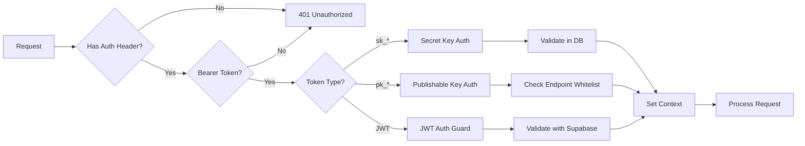

# 🔑 API Key Authentication - Implementation Plan

**Priority:** P1 - Critical
**Estimated Time:** 4 hours
**Complexity:** Medium
**Dependency:** Security Audit (must be completed first)

## 📋 Overview

Implement a dual-key authentication system similar to Stripe's model, allowing developers to authenticate their SDK usage with API keys while maintaining JWT auth for the dashboard.

## 🎯 Why API Keys Matter

### Business Benefits
- **Developer Experience**: Industry-standard authentication (like Stripe, Twilio)
- **Security**: Separate keys for server (secret) and browser (publishable)
- **Scalability**: Easy key rotation without affecting user sessions
- **Analytics**: Track API usage per key/customer
- **Monetization**: Rate limit or bill based on API key usage

### Technical Benefits
- **Stateless**: No session management needed
- **Performance**: Faster than JWT validation
- **Isolation**: Compromised key doesn't affect other customers
- **Flexibility**: Different permissions per key type
- **SDK Ready**: Direct integration with BillingOS SDK

## 🏗️ Architecture Overview

### Key Types

```
sk_test_* (Secret Key - Test Environment)
├── Server-side SDK only
├── Full API access
├── Never expose to client
└── Can perform all operations

sk_live_* (Secret Key - Production)
├── Same as test but for production
└── Separate rate limits

pk_test_* (Publishable Key - Test Environment)
├── Client-side SDK (browser)
├── Limited to safe endpoints
├── Can be exposed in frontend
└── Read-only operations mostly

pk_live_* (Publishable Key - Production)
├── Same as test but for production
└── Higher scrutiny on requests
```

### Authentication Flow



## 📊 Current State vs Target State

### Current State (BillingOS)
- ✅ JWT authentication for dashboard users
- ✅ Session tokens for temporary SDK access
- ✅ API keys table exists
- ❌ No key type differentiation
- ❌ No prefix-based validation
- ❌ No publishable key support
- ❌ No endpoint restrictions

### Target State (After Implementation)
- ✅ JWT authentication (unchanged)
- ✅ Secret key authentication (sk_*)
- ✅ Publishable key authentication (pk_*)
- ✅ Proper key prefixes and validation
- ✅ Endpoint restrictions by key type
- ✅ Environment detection from prefix
- ✅ Key masking in logs

## 🗄️ Database Schema Changes

### Current `api_keys` Table
```sql
CREATE TABLE api_keys (
    id UUID PRIMARY KEY,
    organization_id UUID REFERENCES organizations(id),
    name VARCHAR(255),
    key VARCHAR(255) UNIQUE,
    created_at TIMESTAMP,
    last_used_at TIMESTAMP
);
```

### Required Migration
```sql
-- Add key type enumeration
CREATE TYPE api_key_type AS ENUM ('secret', 'publishable');
CREATE TYPE api_key_environment AS ENUM ('test', 'live');

-- Update api_keys table
ALTER TABLE api_keys
ADD COLUMN key_type api_key_type DEFAULT 'secret',
ADD COLUMN environment api_key_environment DEFAULT 'test',
ADD COLUMN key_prefix VARCHAR(10),
ADD COLUMN key_hash VARCHAR(255),
ADD COLUMN allowed_origins TEXT[],
ADD COLUMN metadata JSONB DEFAULT '{}';

-- Create index for faster lookups
CREATE INDEX idx_api_keys_key_prefix ON api_keys(key_prefix);
CREATE INDEX idx_api_keys_organization_env ON api_keys(organization_id, environment);
```

## 🔧 Implementation Components

### 1. API Key Service Enhancement
- Generate keys with proper prefixes
- Hash keys before storage (only store hash)
- Validate key format and type
- Track usage statistics

### 2. Authentication Guards
- `SecretKeyAuthGuard` - For sk_* keys
- `PublishableKeyAuthGuard` - For pk_* keys
- `CombinedAuthGuard` - Handles JWT + API keys

### 3. Endpoint Restrictions
```typescript
// Publishable keys can only access:
const PUBLISHABLE_KEY_ENDPOINTS = [
  'GET /api/v1/products',
  'GET /api/v1/products/:id',
  'GET /api/v1/checkout/session',
  'POST /api/v1/checkout/create-session',
  'GET /api/v1/customer/portal',
  // No write operations except checkout
];
```

### 4. Context Enrichment
```typescript
interface ApiKeyContext {
  type: 'api_key';
  keyType: 'secret' | 'publishable';
  environment: 'test' | 'live';
  organizationId: string;
  keyId: string;
  keyName: string;
  allowedOrigins?: string[];
}
```

## 📝 Detailed Requirements

### Key Generation
1. **Format**: `{prefix}_{random_string}`
   - Prefix: `sk_test`, `sk_live`, `pk_test`, `pk_live`
   - Random: 32 characters, alphanumeric
   - Example: `sk_test_1a2b3c4d5e6f7g8h9i0j1k2l3m4n5o6p`

2. **Storage**:
   - Store only SHA-256 hash of the key
   - Never store plain text key
   - Return key only once during creation

3. **Validation**:
   - Check prefix matches expected pattern
   - Verify key exists in database
   - Confirm organization is active
   - Check key isn't revoked

### Security Requirements
1. **Secret Keys**:
   - Never log full key (use masking utility)
   - Require HTTPS in production
   - Rate limit by organization
   - Track last usage

2. **Publishable Keys**:
   - CORS validation for browser requests
   - Optional origin restrictions
   - Read-only operations mainly
   - Can be safely exposed

### SDK Integration
```javascript
// Server-side SDK usage
const billingOS = new BillingOS({
  apiKey: 'sk_test_...', // Secret key
});

// Client-side SDK usage
const billingOS = new BillingOS({
  apiKey: 'pk_test_...', // Publishable key
  // Optional: specify allowed origins
});
```

## 🔍 Reference Implementation (Autumn)

**Key Files from Autumn:**
- `/Users/ankushkumar/Code/autumn/server/src/honoMiddlewares/secretKeyMiddleware.ts`
- `/Users/ankushkumar/Code/autumn/server/src/honoMiddlewares/publicKeyMiddleware.ts`

**Patterns to Adopt:**
1. Prefix-based environment detection
2. Separate middleware for each key type
3. Context enrichment with org details
4. Fallback to session auth if needed
5. Comprehensive error messages

**Patterns to Adapt:**
1. Use NestJS guards instead of Hono middleware
2. Integrate with existing Supabase database
3. Maintain compatibility with JWT auth

## ✅ Success Criteria

### Must Have
- [ ] Generate sk_test_ and pk_test_ keys
- [ ] Validate keys in API requests
- [ ] Restrict publishable keys to safe endpoints
- [ ] Mask keys in all logs
- [ ] Store only key hashes
- [ ] Track key usage

### Should Have
- [ ] Key rotation capability
- [ ] Usage analytics per key
- [ ] CORS validation for publishable keys
- [ ] Rate limiting per key
- [ ] Key expiration option

### Nice to Have
- [ ] Multiple keys per organization
- [ ] Granular permissions per key
- [ ] Webhook for key events
- [ ] Key usage dashboard

## 🚦 Risk Mitigation

| Risk | Impact | Mitigation |
|------|--------|------------|
| Breaking existing JWT auth | High | Add new guards, don't modify existing |
| Key generation collision | Low | Use cryptographically secure random |
| Key exposure in logs | High | Use masking utility from security audit |
| Database migration failure | Medium | Test migration thoroughly, have rollback |
| SDK compatibility | Medium | Test with existing SDK implementation |

## 📊 Testing Strategy

1. **Unit Tests**:
   - Key generation uniqueness
   - Key validation logic
   - Hash verification
   - Prefix parsing

2. **Integration Tests**:
   - JWT auth still works
   - Secret key authentication
   - Publishable key restrictions
   - Key rotation flow

3. **E2E Tests**:
   - Full SDK authentication
   - Checkout with publishable key
   - API calls with secret key
   - Mixed auth scenarios

## 🎯 Verification Checklist

- [ ] Can generate both key types
- [ ] Keys have correct prefixes
- [ ] Only hash stored in database
- [ ] Secret keys work on all endpoints
- [ ] Publishable keys restricted properly
- [ ] JWT auth still functional
- [ ] Keys masked in logs
- [ ] SDK authenticates successfully
- [ ] Rate limiting applies per key
- [ ] Usage tracked correctly

## 📚 Additional Resources

- [Stripe API Keys Documentation](https://stripe.com/docs/keys)
- [API Key Best Practices](https://cloud.google.com/endpoints/docs/openapi/when-why-api-key)
- [NestJS Custom Guards](https://docs.nestjs.com/guards)

## 🔄 Dependencies

**Must Complete First:**
- ✅ Security Audit (for masking utilities)

**Can Do in Parallel:**
- Rate Limiting
- Error Handling

**Depends on This:**
- Integration Tests (need auth working)

---

**Remember:** This is the foundation for SDK authentication. Take time to get the security model right - it's harder to change later!