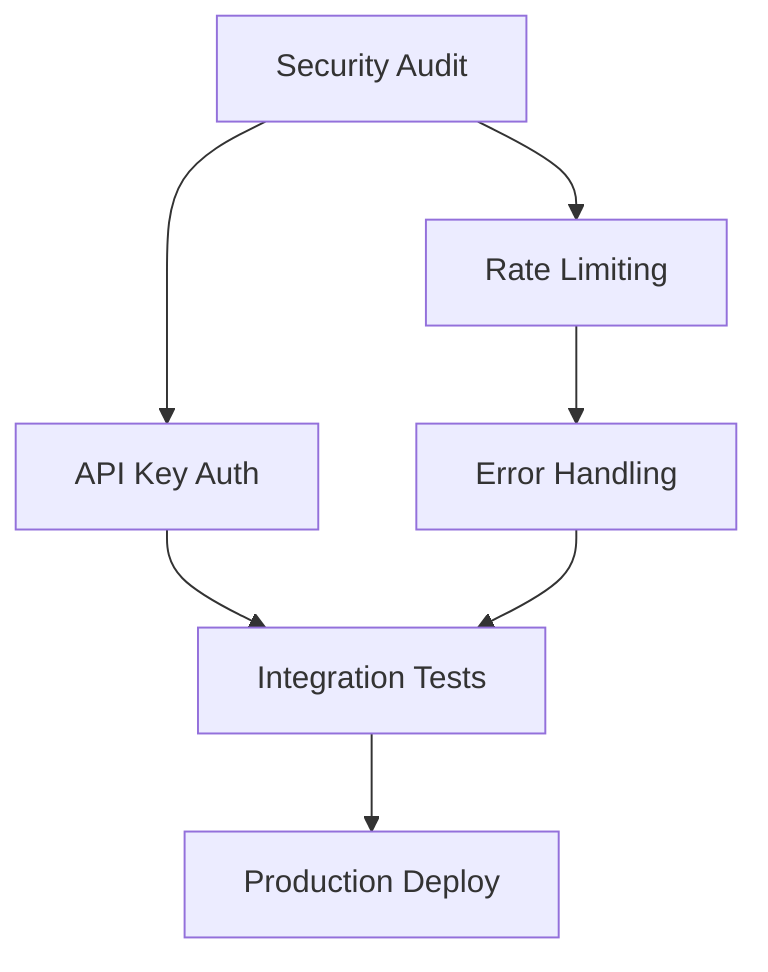

# 🚀 BillingOS P1 Critical Features - Implementation Guide

**Version:** 1.0.0
**Last Updated:** February 23, 2026
**Target Completion:** February 26, 2026
**Total Effort:** 18 hours (2-3 days)

## 📋 Executive Summary

This guide contains comprehensive implementation documentation for all P1 (Priority 1) critical features that must be completed before the BillingOS MVP launch. Each feature has been carefully analyzed from production systems (Autumn and Flowglad) and adapted for our NestJS/Next.js architecture.

## 🎯 P1 Features Overview

| Priority | Feature | Status | Hours | Owner | Documentation |
|----------|---------|--------|-------|-------|---------------|
| 1 | Security Audit | ❌ 0% | 2h | Ankush | [📁 01-security-audit/](./01-security-audit/) |
| 2 | API Key Authentication | ❌ 0% | 4h | Ankush | [📁 02-api-key-auth/](./02-api-key-auth/) |
| 3 | Rate Limiting | ❌ 0% | 3h | Ankush | [📁 03-rate-limiting/](./03-rate-limiting/) |
| 4 | Error Handling | ❌ 30% | 3h | Ankush | [📁 04-error-handling/](./04-error-handling/) |
| 5 | Integration Tests | ❌ 0% | 6h | Ankush | [📁 05-integration-tests/](./05-integration-tests/) |

## 🏗️ Implementation Approach

### Design Principles
1. **No Over-Engineering**: Simple, pragmatic solutions that work
2. **Reference-Based**: Proven patterns from Autumn (security) and Flowglad (testing)
3. **Production-Ready**: Include monitoring, logging, and error recovery
4. **Developer-Friendly**: Clear documentation with copy-paste examples

### What We're Building
- ✅ **Dual Authentication**: JWT (dashboard) + API Keys (SDK)
- ✅ **Three-Tier Rate Limiting**: Global, Organization, Customer levels
- ✅ **Comprehensive Error Handling**: Stripe errors, validation, business logic
- ✅ **Critical Path Testing**: Payment flow, webhooks, auth
- ✅ **Production Monitoring**: Sentry integration with proper context

### What We're NOT Building (Avoiding Complexity)
- ❌ Redis-backed rate limiting (overkill for < 1K req/day)
- ❌ Complex permission systems (simple role-based is enough)
- ❌ 100% test coverage (focus on critical paths)
- ❌ Custom observability (Sentry is sufficient)
- ❌ Request retry mechanisms (SDK handles this)

## 📊 Implementation Roadmap

### Day 1: Security & Authentication (6 hours)
**Morning (3h)**
- [ ] Security audit - Fix all auth TODOs (2h)
- [ ] Add request ID tracking (1h)

**Afternoon (3h)**
- [ ] Implement API key authentication system (3h)
- [ ] Test auth with SDK

### Day 2: Protection & Resilience (6 hours)
**Morning (3h)**
- [ ] Setup rate limiting with @nestjs/throttler (2h)
- [ ] Configure per-endpoint limits (1h)

**Afternoon (3h)**
- [ ] Implement global error handler (2h)
- [ ] Integrate Sentry monitoring (1h)

### Day 3: Testing & Validation (6 hours)
- [ ] Payment flow E2E test (2h)
- [ ] Webhook verification test (1h)
- [ ] API key auth test (1h)
- [ ] Rate limiting test (1h)
- [ ] Error scenario tests (1h)

## 🔄 Dependencies & Order of Implementation



**Critical Path**: Security Audit → API Key Auth → Integration Tests

## 📦 Required Dependencies

```bash
# Install all P1 dependencies at once
cd apps/api
pnpm add @nestjs/throttler @sentry/node @sentry/profiling-node
pnpm add -D @faker-js/faker supertest

# No additional frontend dependencies needed
```

## 🧪 Verification Checklist

### After Security Audit
- [ ] No TODO comments in auth code
- [ ] All sensitive data masked in logs
- [ ] Request IDs present in all responses

### After API Key Implementation
- [ ] Can generate sk_test_ and pk_test_ keys
- [ ] SDK authenticates with API keys
- [ ] Dashboard still works with JWT

### After Rate Limiting
- [ ] Rate limits enforced per tier
- [ ] Graceful degradation on failure
- [ ] Health checks bypass limits

### After Error Handling
- [ ] All Stripe errors handled
- [ ] Consistent error format
- [ ] Errors logged to Sentry

### After Integration Tests
- [ ] All tests pass locally
- [ ] CI/CD pipeline configured
- [ ] Test coverage > 70% for critical paths

## 🚦 Risk Register

| Risk | Probability | Impact | Mitigation |
|------|------------|--------|------------|
| Breaking existing auth | Low | High | Add new auth, don't modify existing |
| Rate limiting too strict | Medium | Medium | Conservative limits, easy to adjust |
| Flaky E2E tests | High | Low | Retry logic, test fixtures |
| Sentry overhead | Low | Low | Sampling rate, async reporting |

## 📈 Success Metrics

- **Security**: Zero auth-related TODOs, all keys masked
- **Performance**: < 100ms auth overhead, < 50ms rate limit check
- **Reliability**: 100% webhook verification, graceful error handling
- **Testing**: All critical paths covered, < 5% test flakiness
- **Monitoring**: All errors captured in Sentry with context

## 🔗 Reference Implementations

### Autumn (Primary Reference)
- **Location**: `/Users/ankushkumar/Code/autumn`
- **Strengths**: Production-ready security, rate limiting, error handling
- **Key Files**:
  - `server/src/honoMiddlewares/secretKeyMiddleware.ts` - API key auth
  - `server/src/honoMiddlewares/rateLimitMiddleware.ts` - Rate limiting
  - `server/src/honoMiddlewares/errorMiddleware.ts` - Error handling

### Flowglad (Testing Reference)
- **Location**: `/Users/ankushkumar/Code/flowglad`
- **Strengths**: Webhook testing, E2E patterns
- **Key Files**:
  - `packages/server/src/webhook.test.ts` - Webhook tests
  - `packages/server/src/test/helpers.ts` - Test utilities

## 🎓 How to Use This Guide

1. **Start with README.md** (this file) for overview
2. **Read plan.md** in each folder to understand the "why"
3. **Follow implementation.md** step-by-step
4. **Use provided code examples** (copy-paste ready)
5. **Run tests from testing.md** to verify
6. **Check off items** in this README as completed

## 📝 Quick Links

- [Security Audit Plan](./01-security-audit/plan.md)
- [API Key Auth Implementation](./02-api-key-auth/implementation.md)
- [Rate Limiting Setup](./03-rate-limiting/implementation.md)
- [Error Handling Guide](./04-error-handling/implementation.md)
- [Integration Test Suite](./05-integration-tests/implementation.md)

## 💬 Support & Questions

- **Technical Lead**: Ankush Kumar
- **Slack Channel**: #billing-platform
- **Documentation Issues**: Create issue in GitHub

## 🎉 Post-Launch Enhancements

Once MVP is successful, consider:
- Redis-backed rate limiting for scale
- Advanced API versioning
- GraphQL API layer
- Webhook retry mechanisms
- Custom metrics dashboard

---

**Remember**: The goal is a secure, stable MVP - not perfection. Focus on critical paths, ship fast, iterate based on real usage!