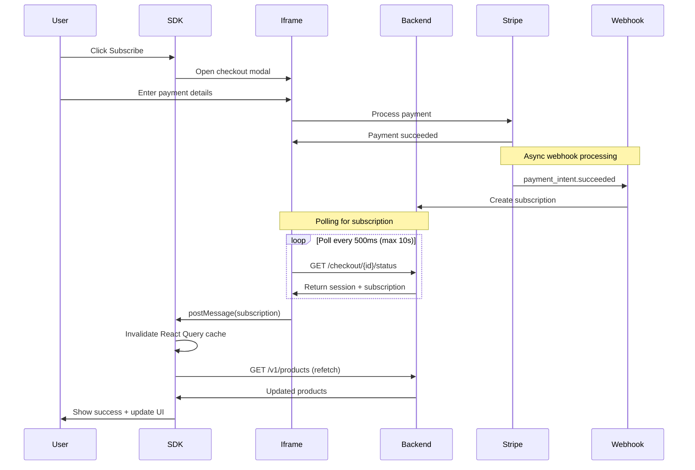

# Real-time Subscription Updates

## Overview

The BillingOS SDK now supports real-time subscription status updates after successful payment, eliminating the need for page reloads. When a customer completes a payment, the UI automatically updates to reflect their new subscription status with visual feedback.

## Architecture

### Data Flow



## Implementation Details

### 1. Backend - Subscription Polling

**File**: `apps/api/src/v1/checkout/checkout.service.ts`

The `getCheckoutStatus` endpoint now checks for subscription creation:

```typescript
// Check if subscription exists for this payment intent
let subscription = null;
if (paymentIntent.stripe_payment_intent_id) {
  const { data: subscriptionData } = await supabase
    .from('subscriptions')
    .select('*')
    .eq('payment_intent_id', paymentIntent.id)
    .single();

  subscription = subscriptionData;
}

// Include subscription in response
return {
  // ... other fields
  subscription: subscription ? {
    id: subscription.id,
    customerId: subscription.customer_id,
    productId: subscription.product_id,
    priceId: subscription.price_id,
    status: subscription.status,
    currentPeriodStart: subscription.current_period_start,
    currentPeriodEnd: subscription.current_period_end,
    cancelAtPeriodEnd: subscription.cancel_at_period_end || false,
  } : undefined,
};
```

### 2. Frontend - Polling Implementation

**File**: `apps/web/src/app/embed/checkout/[sessionId]/components/CheckoutForm.tsx`

After payment succeeds, the iframe polls for subscription data:

```typescript
if (paymentIntent?.status === 'succeeded') {
  // Poll for subscription data
  let attempts = 0;
  const maxAttempts = 20; // Poll for up to 10 seconds

  const pollForSubscription = async () => {
    try {
      const response = await fetch(`/api/v1/checkout/${session.id}/status`)
      const data = await response.json()

      if (data.subscription) {
        // Subscription created, notify parent with real data
        onSuccess(data.subscription)
      } else if (attempts < maxAttempts) {
        // Keep polling
        attempts++
        setTimeout(pollForSubscription, 500)
      } else {
        // Timeout - still notify success
        onSuccess(undefined)
      }
    } catch (error) {
      console.error('Error polling:', error)
      onSuccess(undefined)
    }
  }

  pollForSubscription()
}
```

### 3. SDK - React Query Cache Invalidation

**File**: `billingos-sdk/src/components/PricingTable/PricingTable.tsx`

The SDK handles payment success by invalidating caches and updating UI:

```typescript
const handlePaymentSuccess = React.useCallback(async (subscription?: any) => {
  console.log('🔄 Invalidating products cache...')

  // Invalidate and refetch products
  await queryClient.invalidateQueries({
    queryKey: ['products'],
    refetchType: 'all'
  })

  // Force immediate refetch
  await refetch()

  // Show success notification
  setShowSuccess(true)
  setTimeout(() => setShowSuccess(false), 5000)

  // Optimistic update
  if (subscription?.priceId) {
    setCurrentPlanIds([subscription.priceId])
  }
}, [queryClient, refetch, planIds])
```

### 4. SDK - Success Notification UI

```typescript
{showSuccess && (
  <div className="billingos-success-notification">
    <div className="billingos-success-content">
      <svg className="billingos-success-icon">
        {/* Checkmark icon */}
      </svg>
      <p>Payment successful! Your subscription is now active.</p>
    </div>
  </div>
)}
```

## Key Features

### ✅ No Page Reload Required
- Uses React Query cache invalidation
- PostMessage communication between iframe and parent
- Automatic UI updates

### ✅ Real Subscription Data
- Polls backend for actual subscription created by webhook
- No mock data - always accurate
- Handles async webhook delays

### ✅ Visual Feedback
- Success notification with animation
- Plan button updates to "Current Plan"
- Loading states during updates

### ✅ Resilient Design
- Timeout after 10 seconds to prevent infinite polling
- Graceful fallback if subscription not found
- Error handling at every step

## Configuration

### React Query Setup

The SDK configures React Query for immediate updates:

```typescript
const { data: products, refetch } = useQuery({
  queryKey: ['products', apiUrl, sessionToken, organizationId],
  queryFn: fetchProducts,
  staleTime: forceRefetch ? 0 : 5 * 60 * 1000, // Force refetch after payment
  refetchOnWindowFocus: false,
})
```

### Webhook Configuration

Ensure Stripe webhooks are properly configured to handle:
- `payment_intent.succeeded` - Creates subscription
- `payment_intent.payment_failed` - Updates status

## Testing

### Manual Testing Steps

1. **Start all services**:
   ```bash
   pnpm dev:api    # Backend on port 3001
   pnpm dev:web    # Frontend on port 3000
   supabase start  # Local Supabase
   ```

2. **Update SDK in test app**:
   ```bash
   cd /Users/ankushkumar/Code/billingos-testprojects/my-app
   pnpm update @billingos/sdk@latest
   ```

3. **Test payment flow**:
   - Open pricing page
   - Click "Subscribe" on any plan
   - Use test card: 4242 4242 4242 4242
   - Complete payment
   - Observe real-time updates

### Expected Behavior

1. **Immediate**: Payment processing spinner
2. **After success**: Success notification appears
3. **Within 1-2 seconds**: Subscription data received
4. **UI Updates**: Plan button shows "Current Plan"
5. **No reload**: Page stays on same view

### Debug Checklist

- [ ] Browser console shows cache invalidation logs
- [ ] Network tab shows polling requests
- [ ] Database has subscription record
- [ ] Webhook endpoint is accessible
- [ ] No CORS errors in console

## Troubleshooting

### Updates Not Appearing

1. **Clear browser cache**
   ```bash
   # Force refresh
   Cmd+Shift+R (Mac) or Ctrl+Shift+R (Windows/Linux)
   ```

2. **Check webhook logs**
   ```bash
   stripe listen --forward-to localhost:3001/stripe/webhooks
   ```

3. **Verify subscription creation**
   ```sql
   SELECT * FROM subscriptions
   WHERE created_at > NOW() - INTERVAL '5 minutes'
   ORDER BY created_at DESC;
   ```

### Polling Timeout

If polling times out without finding subscription:
- Check webhook processing time
- Verify Stripe webhook secret is correct
- Ensure database connection is stable
- Check for errors in webhook handler

### Performance Considerations

- Polling limited to 20 attempts (10 seconds max)
- 500ms interval between polls
- Automatic cache invalidation is debounced
- Success notification auto-dismisses after 5 seconds

## Future Enhancements

- [ ] WebSocket for instant updates instead of polling
- [ ] Configurable polling intervals
- [ ] Custom success notification templates
- [ ] Offline support with sync
- [ ] Optimistic UI updates before confirmation

## API Reference

### CheckoutModal Props

```typescript
interface CheckoutModalProps {
  onSuccess?: (subscription?: Subscription) => void
  // Receives real subscription data on success
}
```

### Subscription Type

```typescript
interface Subscription {
  id: string
  customerId: string
  productId: string
  priceId: string
  status: 'active' | 'canceled' | 'past_due' | 'trialing'
  currentPeriodStart: string
  currentPeriodEnd: string
  cancelAtPeriodEnd: boolean
}
```

## Browser Compatibility

- Chrome 90+
- Firefox 88+
- Safari 14+
- Edge 90+

All modern browsers supporting:
- PostMessage API
- Fetch API
- React 18+
- ES2020+