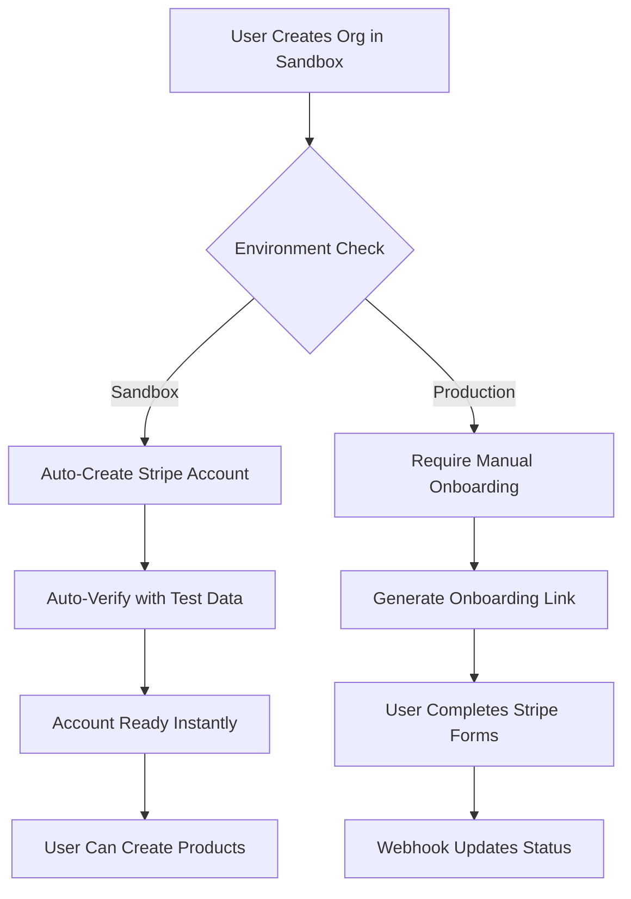
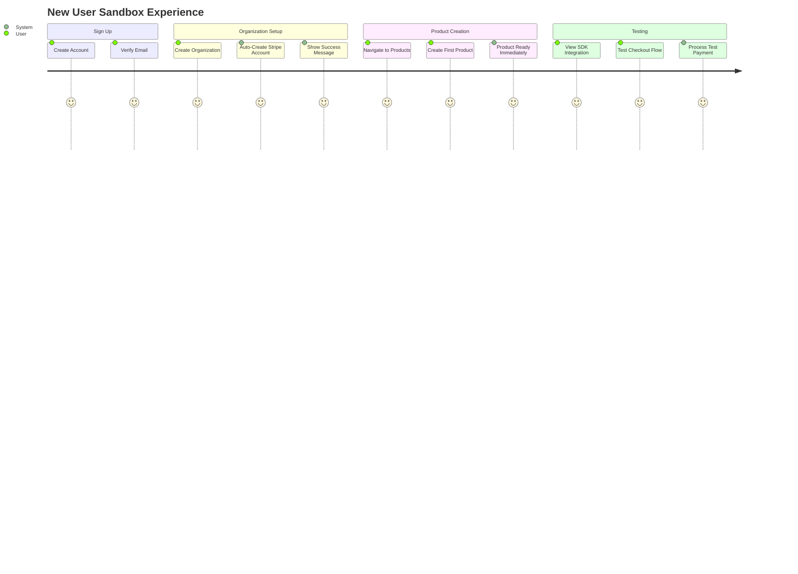
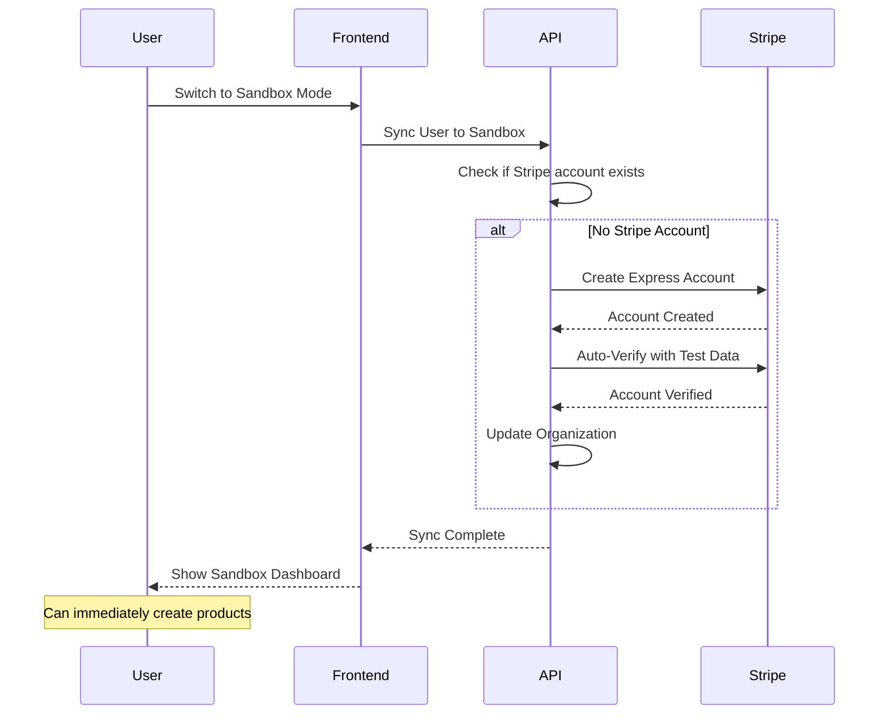

# BillingOS Sandbox Test Account Auto-Creation Plan

## Executive Summary

This document outlines the implementation plan for removing Stripe Connect onboarding friction in sandbox mode by automatically creating and verifying Stripe test accounts programmatically. This enhancement integrates with the existing sandbox infrastructure plan while maintaining proper account isolation and security.

## Problem Statement

### Current Issues
1. **High Friction**: Organizations must complete Stripe Connect onboarding before creating products or testing the SDK
2. **Unnecessary Complexity**: Test mode doesn't need real business verification, yet users must fill out forms
3. **Delayed Testing**: Developers can't immediately test BillingOS features after signing up
4. **Poor DX**: The onboarding requirement in sandbox contradicts the "quick start" developer experience

### Impact
- Developers abandon the platform during onboarding
- Support tickets about "why can't I create products?"
- Slower adoption and integration testing
- Confusion between test and production requirements

## Solution Overview

### Core Approach
Automatically create and verify Stripe Express test accounts using Stripe's programmatic verification API with special test values. Each organization still maintains its own isolated Stripe account, but verification happens instantly without user interaction.

### Key Principles
1. **Zero Friction**: Sandbox works immediately upon organization creation
2. **Proper Isolation**: Each org has its own Stripe account (not shared)
3. **Real Testing**: Uses actual Stripe test mode APIs, not mocked
4. **Optional Override**: Users can still manually connect their own test account if preferred
5. **Production Unchanged**: Production mode still requires full KYC/onboarding

## Technical Architecture

### How It Works



### Integration with Existing Architecture

This enhancement fits seamlessly into the separated infrastructure approach:

```
SANDBOX ENVIRONMENT (sandbox-api.billingos.dev):
- Auto-creates Stripe test accounts on org creation
- Uses Stripe test keys (sk_test_...)
- Bypasses verification with test data
- No manual onboarding required

PRODUCTION ENVIRONMENT (api.billingos.dev):
- Maintains current flow
- Requires real Stripe onboarding
- Uses live keys (sk_live_...)
- Full KYC verification required
```

## Implementation Details

### Phase 1: Backend Core Changes

#### 1.1 Stripe Service Enhancement
**File**: `apps/api/src/stripe/stripe.service.ts`

Add new methods for test account creation:

```typescript
@Injectable()
export class StripeService {
  // ... existing code ...

  /**
   * Check if running in test mode
   */
  private isTestMode(): boolean {
    const apiKey = this.configService.get<string>('STRIPE_SECRET_KEY');
    return apiKey?.startsWith('sk_test_') || false;
  }

  /**
   * Check if running in sandbox environment
   */
  private isSandboxEnvironment(): boolean {
    return this.configService.get<string>('NODE_ENV') === 'sandbox';
  }

  /**
   * Create and auto-verify a test account (sandbox only)
   */
  async createTestAccountWithBypass(params: {
    email: string;
    country: string;
    businessType?: string;
    organizationName?: string;
  }): Promise<Stripe.Account> {
    // Safety check - only works in sandbox with test keys
    if (!this.isTestMode() || !this.isSandboxEnvironment()) {
      throw new Error('Auto-verification only available in sandbox mode with test keys');
    }

    // Step 1: Create Express account
    const account = await this.stripe.accounts.create({
      type: 'express',
      email: params.email,
      country: params.country || 'US',
      business_type: params.businessType || 'individual',
      capabilities: {
        card_payments: { requested: true },
        transfers: { requested: true },
      },
      metadata: {
        auto_created: 'true',
        organization_name: params.organizationName || '',
        environment: 'sandbox',
      },
    });

    // Step 2: Auto-verify with Stripe's special test values
    try {
      await this.stripe.accounts.update(account.id, {
        individual: {
          first_name: 'Test',
          last_name: 'Merchant',
          email: params.email,
          phone: '+16505551234',
          dob: {
            day: 1,
            month: 1,
            year: 1901, // Magic date for instant verification
          },
          address: {
            line1: 'address_full_match', // Magic address for verification
            city: 'San Francisco',
            state: 'CA',
            postal_code: '94102',
            country: params.country || 'US',
          },
          ssn_last_4: '0000', // Test SSN
        },
        business_type: 'individual',
        business_profile: {
          mcc: '5734', // Computer Software Stores
          name: params.organizationName || 'Test Business',
          url: 'https://example.com',
        },
        tos_acceptance: {
          date: Math.floor(Date.now() / 1000),
          ip: '127.0.0.1',
          user_agent: 'BillingOS Sandbox Auto-Creation',
        },
        external_account: {
          object: 'bank_account',
          country: params.country || 'US',
          currency: 'usd',
          account_holder_name: 'Test Merchant',
          account_holder_type: 'individual',
          routing_number: '110000000', // Test routing number
          account_number: '000123456789', // Test account number
        },
      });

      // Step 3: Retrieve the updated account
      const verifiedAccount = await this.stripe.accounts.retrieve(account.id);

      return verifiedAccount;
    } catch (error) {
      // If auto-verification fails, return the account anyway
      // User can still complete manual onboarding if needed
      console.error('Auto-verification failed, returning unverified account:', error);
      return account;
    }
  }

  /**
   * Smart account creation - auto-verify in sandbox, normal flow in production
   */
  async createConnectAccountSmart(params: {
    email: string;
    country: string;
    businessType?: string;
    organizationName?: string;
  }): Promise<Stripe.Account> {
    if (this.isSandboxEnvironment() && this.isTestMode()) {
      return this.createTestAccountWithBypass(params);
    } else {
      return this.createConnectAccount(params);
    }
  }
}
```

#### 1.2 Account Service Updates
**File**: `apps/api/src/account/account.service.ts`

Modify account creation to use smart method:

```typescript
@Injectable()
export class AccountService {
  async create(userId: string, organizationId: string, dto: CreateAccountDto) {
    // ... existing validation ...

    // Use smart creation method that handles sandbox auto-verification
    const stripeAccount = await this.stripeService.createConnectAccountSmart({
      email: dto.email,
      country: dto.country,
      businessType: dto.businessType,
      organizationName: org.name,
    });

    // Check if account was auto-verified (sandbox mode)
    const isAutoVerified = stripeAccount.metadata?.auto_created === 'true';

    // Create database record
    const { data: account, error } = await this.supabaseService
      .getServiceRoleClient()
      .from('accounts')
      .insert({
        organization_id: organizationId,
        stripe_account_id: stripeAccount.id,
        status: isAutoVerified ? 'active' : 'pending',
        auto_created: isAutoVerified,
        // ... other fields
      })
      .select()
      .single();

    // If auto-verified, update organization immediately
    if (isAutoVerified) {
      await this.supabaseService
        .getServiceRoleClient()
        .from('organizations')
        .update({
          account_id: account.id,
          stripe_connected: true,
        })
        .eq('id', organizationId);
    }

    return account;
  }
}
```

#### 1.3 Organization Service Enhancement
**File**: `apps/api/src/organization/organization.service.ts`

Auto-create Stripe account on org creation in sandbox:

```typescript
@Injectable()
export class OrganizationService {
  async create(userId: string, dto: CreateOrganizationDto) {
    // ... existing org creation logic ...

    // Auto-create Stripe account in sandbox mode
    if (this.configService.get<string>('NODE_ENV') === 'sandbox') {
      try {
        const user = await this.userService.findById(userId);

        await this.accountService.create(userId, organization.id, {
          email: user.email,
          country: dto.country || 'US',
          businessType: dto.businessType || 'individual',
        });

        // Log auto-creation
        console.log(`Auto-created Stripe account for org ${organization.id} in sandbox mode`);
      } catch (error) {
        // Don't fail org creation if Stripe account fails
        console.error('Failed to auto-create Stripe account:', error);
      }
    }

    return organization;
  }
}
```

#### 1.4 Product Service Updates
**File**: `apps/api/src/products/products.service.ts`

Relax Stripe requirement in sandbox:

```typescript
@Injectable()
export class ProductsService {
  async create(organizationId: string, dto: CreateProductDto) {
    // Get organization with account
    const org = await this.getOrganizationWithAccount(organizationId);

    // Modified check - allow in sandbox even without full onboarding
    const isSandbox = this.configService.get<string>('NODE_ENV') === 'sandbox';

    if (!org.account_id && !isSandbox) {
      throw new BadRequestException(
        'Organization must complete Stripe Connect onboarding first'
      );
    }

    // In sandbox, allow product creation even without Stripe account
    // Products will be created in database only until Stripe account exists
    let stripeProduct = null;

    if (org.account?.stripe_account_id) {
      // Create in Stripe if account exists
      stripeProduct = await this.createStripeProduct(
        org.account.stripe_account_id,
        dto
      );
    }

    // Create in database
    const product = await this.createDatabaseProduct({
      ...dto,
      organization_id: organizationId,
      stripe_product_id: stripeProduct?.id || null,
      // Mark as pending sync if no Stripe account yet
      sync_status: stripeProduct ? 'synced' : 'pending',
    });

    return product;
  }

  /**
   * Sync pending products to Stripe when account becomes available
   */
  async syncPendingProducts(organizationId: string, stripeAccountId: string) {
    const pendingProducts = await this.supabaseService
      .getServiceRoleClient()
      .from('products')
      .select('*')
      .eq('organization_id', organizationId)
      .eq('sync_status', 'pending');

    for (const product of pendingProducts.data || []) {
      try {
        const stripeProduct = await this.createStripeProduct(
          stripeAccountId,
          product
        );

        await this.supabaseService
          .getServiceRoleClient()
          .from('products')
          .update({
            stripe_product_id: stripeProduct.id,
            sync_status: 'synced',
          })
          .eq('id', product.id);
      } catch (error) {
        console.error(`Failed to sync product ${product.id}:`, error);
      }
    }
  }
}
```

### Phase 2: Database Schema Updates

#### 2.1 Migration for Account Tracking
**File**: `supabase/migrations/[timestamp]_add_test_account_tracking.sql`

```sql
-- Add fields to track auto-created test accounts
ALTER TABLE accounts ADD COLUMN IF NOT EXISTS auto_created BOOLEAN DEFAULT FALSE;
ALTER TABLE accounts ADD COLUMN IF NOT EXISTS test_mode BOOLEAN DEFAULT FALSE;
ALTER TABLE accounts ADD COLUMN IF NOT EXISTS created_at TIMESTAMP WITH TIME ZONE DEFAULT NOW();

-- Add sync status for products
ALTER TABLE products ADD COLUMN IF NOT EXISTS sync_status TEXT DEFAULT 'synced';

-- Add index for pending sync products
CREATE INDEX IF NOT EXISTS idx_products_sync_status
  ON products(organization_id, sync_status)
  WHERE sync_status = 'pending';

-- Add comment for documentation
COMMENT ON COLUMN accounts.auto_created IS 'True if account was auto-created and verified in sandbox mode';
COMMENT ON COLUMN accounts.test_mode IS 'True if this is a test mode Stripe account';
COMMENT ON COLUMN products.sync_status IS 'Track if product is synced with Stripe: synced, pending, failed';
```

### Phase 3: Frontend UI Updates

#### 3.1 Stripe Account Status Component
**File**: `apps/web/src/components/stripe-account-status.tsx`

```typescript
import { Badge } from "@/components/ui/badge";
import { Button } from "@/components/ui/button";
import { Alert, AlertDescription } from "@/components/ui/alert";
import { InfoIcon, CheckCircle, AlertCircle } from "lucide-react";

interface StripeAccountStatusProps {
  account: {
    status: string;
    auto_created: boolean;
    test_mode: boolean;
    stripe_account_id: string;
  } | null;
  environment: 'sandbox' | 'production';
}

export function StripeAccountStatus({ account, environment }: StripeAccountStatusProps) {
  // No account in production - show setup required
  if (!account && environment === 'production') {
    return (
      <Alert className="border-red-200 bg-red-50">
        <AlertCircle className="h-4 w-4 text-red-600" />
        <AlertDescription className="text-red-800">
          Stripe Connect setup required to accept payments.
          <Button variant="default" className="ml-2" size="sm">
            Complete Setup
          </Button>
        </AlertDescription>
      </Alert>
    );
  }

  // Auto-created account in sandbox
  if (account?.auto_created && environment === 'sandbox') {
    return (
      <Alert className="border-green-200 bg-green-50">
        <CheckCircle className="h-4 w-4 text-green-600" />
        <AlertDescription className="text-green-800">
          <div className="flex items-center justify-between">
            <div>
              <span className="font-medium">Test account ready!</span>
              <span className="ml-2 text-sm">
                Your Stripe test account was automatically configured.
              </span>
            </div>
            <Badge variant="outline" className="ml-2">Auto-Created</Badge>
          </div>
          <div className="mt-2 text-sm text-gray-600">
            You can start creating products and accepting test payments immediately.
            {' '}
            <a href="#" className="text-blue-600 underline">
              Connect your own test account
            </a>
            {' '}(optional)
          </div>
        </AlertDescription>
      </Alert>
    );
  }

  // Manual account connected
  if (account && !account.auto_created) {
    return (
      <Alert className="border-blue-200 bg-blue-50">
        <InfoIcon className="h-4 w-4 text-blue-600" />
        <AlertDescription className="text-blue-800">
          <div className="flex items-center">
            <span>Connected to Stripe:</span>
            <code className="ml-2 text-sm">{account.stripe_account_id}</code>
            {account.test_mode && <Badge className="ml-2">Test Mode</Badge>}
          </div>
        </AlertDescription>
      </Alert>
    );
  }

  return null;
}
```

#### 3.2 Updated Organization Dashboard
**File**: `apps/web/src/app/dashboard/[organization]/page.tsx`

Add status display for Stripe account:

```typescript
export default async function OrganizationDashboard({ params }: Props) {
  const { organization } = params;
  const env = getEnvironment(); // Helper to get current environment

  // Fetch org with account details
  const org = await apiServer.get<Organization>(
    `/organizations/${organization}`
  );

  return (
    <div className="space-y-6">
      {/* Show test mode banner if in sandbox */}
      {env === 'sandbox' && <TestModeBanner />}

      {/* Stripe account status */}
      <StripeAccountStatus
        account={org.account}
        environment={env}
      />

      {/* Rest of dashboard... */}
    </div>
  );
}
```

#### 3.3 Product Creation Flow
**File**: `apps/web/src/app/dashboard/[organization]/products/new/page.tsx`

Allow product creation in sandbox without Stripe:

```typescript
export default function NewProductPage() {
  const { organization } = useOrganization();
  const environment = useEnvironment();

  // In sandbox, always allow product creation
  const canCreateProduct =
    environment === 'sandbox' ||
    organization?.account_id;

  if (!canCreateProduct && environment === 'production') {
    return (
      <Alert>
        <AlertDescription>
          Please complete Stripe Connect setup before creating products.
          <Link href="/dashboard/finance/account">
            <Button className="ml-2">Setup Stripe</Button>
          </Link>
        </AlertDescription>
      </Alert>
    );
  }

  return <ProductForm />;
}
```

### Phase 4: Configuration & Environment

#### 4.1 Environment Variables
**File**: `apps/api/.env.sandbox`

```bash
# Sandbox-specific configuration
NODE_ENV=sandbox
STRIPE_SECRET_KEY=sk_test_... # Test key
STRIPE_WEBHOOK_SECRET=whsec_test_...
STRIPE_AUTO_VERIFY_TEST_ACCOUNTS=true
STRIPE_TEST_ACCOUNT_COUNTRY=US

# Feature flags
FEATURE_AUTO_CREATE_STRIPE_ACCOUNTS=true
FEATURE_ALLOW_PRODUCTS_WITHOUT_STRIPE=true
```

#### 4.2 Configuration Service
**File**: `apps/api/src/config/stripe.config.ts`

```typescript
export const stripeConfig = {
  // Test values for auto-verification
  testVerification: {
    individual: {
      firstName: 'Test',
      lastName: 'Merchant',
      dob: { day: 1, month: 1, year: 1901 },
      address: {
        line1: 'address_full_match',
        city: 'San Francisco',
        state: 'CA',
        postalCode: '94102',
        country: 'US',
      },
      ssnLast4: '0000',
      phone: '+16505551234',
    },
    bankAccount: {
      routingNumber: '110000000',
      accountNumber: '000123456789',
      accountHolderName: 'Test Merchant',
      accountHolderType: 'individual',
    },
  },

  // Feature flags
  features: {
    autoCreateAccounts: process.env.FEATURE_AUTO_CREATE_STRIPE_ACCOUNTS === 'true',
    allowProductsWithoutStripe: process.env.FEATURE_ALLOW_PRODUCTS_WITHOUT_STRIPE === 'true',
  },
};
```

### Phase 5: Testing Strategy

#### 5.1 Unit Tests
**File**: `apps/api/src/stripe/stripe.service.spec.ts`

```typescript
describe('StripeService - Test Account Creation', () => {
  it('should auto-create and verify account in sandbox mode', async () => {
    // Mock configuration
    jest.spyOn(configService, 'get').mockImplementation((key) => {
      if (key === 'NODE_ENV') return 'sandbox';
      if (key === 'STRIPE_SECRET_KEY') return 'sk_test_...';
      return null;
    });

    const account = await service.createTestAccountWithBypass({
      email: 'test@example.com',
      country: 'US',
      organizationName: 'Test Org',
    });

    expect(account.id).toMatch(/^acct_/);
    expect(account.metadata.auto_created).toBe('true');
  });

  it('should throw error if not in test mode', async () => {
    jest.spyOn(configService, 'get').mockImplementation((key) => {
      if (key === 'NODE_ENV') return 'production';
      if (key === 'STRIPE_SECRET_KEY') return 'sk_live_...';
      return null;
    });

    await expect(
      service.createTestAccountWithBypass({
        email: 'test@example.com',
        country: 'US',
      })
    ).rejects.toThrow('Auto-verification only available in sandbox mode');
  });
});
```

#### 5.2 Integration Tests
**File**: `apps/api/test/sandbox-flow.e2e-spec.ts`

```typescript
describe('Sandbox Flow (e2e)', () => {
  it('should allow full flow without manual Stripe setup', async () => {
    // 1. Create organization
    const orgResponse = await request(app.getHttpServer())
      .post('/organizations')
      .set('Authorization', `Bearer ${testToken}`)
      .send({ name: 'Test Org' })
      .expect(201);

    const orgId = orgResponse.body.id;

    // 2. Verify Stripe account was auto-created
    const accountResponse = await request(app.getHttpServer())
      .get(`/organizations/${orgId}`)
      .set('Authorization', `Bearer ${testToken}`)
      .expect(200);

    expect(accountResponse.body.account).toBeDefined();
    expect(accountResponse.body.account.auto_created).toBe(true);

    // 3. Create product immediately
    const productResponse = await request(app.getHttpServer())
      .post('/products')
      .set('Authorization', `Bearer ${testToken}`)
      .send({
        organization_id: orgId,
        name: 'Test Product',
        price: 1000,
      })
      .expect(201);

    expect(productResponse.body.id).toBeDefined();

    // 4. Create checkout session
    const checkoutResponse = await request(app.getHttpServer())
      .post('/v1/checkout/sessions')
      .send({
        product_id: productResponse.body.id,
        success_url: 'https://example.com/success',
        cancel_url: 'https://example.com/cancel',
      })
      .expect(201);

    expect(checkoutResponse.body.url).toContain('checkout.stripe.com');
  });
});
```

### Phase 6: User Experience Flows

#### 6.1 New User Journey (Sandbox)



#### 6.2 Existing User Switch to Sandbox



### Phase 7: Migration & Rollout

#### 7.1 Feature Flag Rollout

```typescript
// Progressive rollout configuration
export const rolloutConfig = {
  sandbox: {
    autoCreateAccounts: {
      enabled: true,
      percentage: 100, // Enable for all sandbox users
      whitelist: [], // Specific org IDs to always enable
      blacklist: [], // Specific org IDs to always disable
    },
  },
  production: {
    autoCreateAccounts: {
      enabled: false, // Never in production
      percentage: 0,
    },
  },
};
```

#### 7.2 Backwards Compatibility

Ensure existing organizations work correctly:

```typescript
async function migrateExistingOrganizations() {
  // Find orgs without Stripe accounts in sandbox
  const orgsWithoutStripe = await db
    .from('organizations')
    .select('*')
    .is('account_id', null)
    .eq('environment', 'sandbox');

  for (const org of orgsWithoutStripe) {
    try {
      // Auto-create Stripe account
      await accountService.createAutoAccount(org.id);
      console.log(`Migrated org ${org.id} to auto-account`);
    } catch (error) {
      console.error(`Failed to migrate org ${org.id}:`, error);
    }
  }
}
```

### Phase 8: Monitoring & Observability

#### 8.1 Metrics to Track

```typescript
// Track account creation metrics
export const metrics = {
  accountCreation: {
    total: new Counter('stripe_accounts_created_total'),
    autoCreated: new Counter('stripe_accounts_auto_created_total'),
    manualCreated: new Counter('stripe_accounts_manual_created_total'),
    failures: new Counter('stripe_accounts_creation_failures_total'),
  },

  productCreation: {
    withStripe: new Counter('products_created_with_stripe_total'),
    withoutStripe: new Counter('products_created_without_stripe_total'),
    syncPending: new Gauge('products_sync_pending_count'),
  },

  sandboxUsage: {
    activeOrgs: new Gauge('sandbox_active_organizations'),
    accountsAutoCreated: new Gauge('sandbox_accounts_auto_created'),
  },
};
```

#### 8.2 Logging Strategy

```typescript
// Structured logging for account operations
logger.info('Stripe account auto-created', {
  organizationId: org.id,
  stripeAccountId: account.id,
  environment: 'sandbox',
  method: 'auto-verification',
  timestamp: new Date().toISOString(),
});
```

## Success Criteria

### Immediate Goals
- [ ] Organizations can create products immediately in sandbox
- [ ] No Stripe onboarding required for test mode
- [ ] SDK components work without manual setup
- [ ] Clear UI indicators for auto-created accounts

### Long-term Goals
- [ ] 80% reduction in time to first product creation
- [ ] 90% of sandbox users never need manual Stripe setup
- [ ] Zero confusion between sandbox and production requirements
- [ ] Improved developer satisfaction scores

## Security Considerations

### Account Isolation
- Each organization maintains its own Stripe account
- Test accounts cannot process real payments
- Auto-verification only works with test keys
- Production environment completely unaffected

### Data Protection
- Test data clearly marked in database
- No mixing of test and production accounts
- Audit logs for all auto-creation events
- Rate limiting on account creation endpoints

## Rollback Plan

If issues arise:

1. **Disable Auto-Creation**: Set `FEATURE_AUTO_CREATE_STRIPE_ACCOUNTS=false`
2. **Revert to Manual Flow**: Organizations use standard onboarding
3. **Preserve Existing Accounts**: Auto-created accounts remain functional
4. **Communicate Changes**: Notify affected users of temporary change

## Documentation Updates

### Developer Documentation
- Update API docs with sandbox account behavior
- Add sandbox quickstart guide
- Document test values for manual testing
- Provide troubleshooting guide

### User Documentation
- Explain auto-account creation in onboarding
- Add FAQ about test accounts
- Document how to connect custom test account
- Clarify sandbox vs production differences

## Timeline

### Week 1: Backend Implementation
- Day 1-2: Implement auto-verification methods
- Day 3-4: Update organization/account services
- Day 5: Testing and error handling

### Week 2: Frontend & Testing
- Day 1-2: UI components for account status
- Day 3-4: Integration testing
- Day 5: Documentation updates

### Week 3: Rollout
- Day 1: Deploy to sandbox environment
- Day 2-3: Monitor metrics and logs
- Day 4-5: Gather feedback and iterate

## Conclusion

This implementation removes the primary friction point for sandbox mode - Stripe Connect onboarding - while maintaining proper account isolation and security. By automatically creating and verifying test accounts, developers can immediately start testing BillingOS features without any setup overhead.

The solution is:
- **Simple**: Minimal code changes, uses Stripe's existing test infrastructure
- **Safe**: Only affects sandbox, production unchanged
- **Scalable**: Each org still has its own account
- **Reversible**: Can easily revert to manual flow if needed

This enhancement will significantly improve the developer experience and accelerate BillingOS adoption.