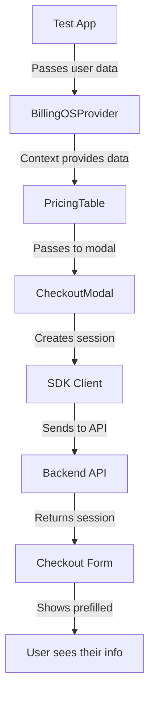

# Customer Data Prefill in BillingOS SDK

## Overview

The BillingOS SDK supports prefilling customer information (email and name) in the checkout form, providing a smoother checkout experience by eliminating the need for users to re-enter their information.

## How It Works

### 1. **Test App Provides Customer Data**

When initializing the BillingOS SDK, pass the customer information to the provider:

```tsx
// In your app (e.g., test app's BillingOSProvider.tsx)
<BillingOSProvider
  sessionToken={sessionToken}
  customerId={currentUser.id}
  customerEmail={currentUser.email}    // ← Prefill email
  customerName={currentUser.name}      // ← Prefill name
>
  {children}
</BillingOSProvider>
```

### 2. **SDK Components Access Customer Data**

The PricingTable component automatically retrieves customer data from the context:

```tsx
// Inside PricingTable component
const { customerEmail, customerName } = useBillingOS()
```

### 3. **CheckoutModal Receives Customer Data**

The PricingTable passes the customer data to the CheckoutModal:

```tsx
<CheckoutModal
  open={isPaymentOpen}
  priceId={selectedPriceId}
  customer={{
    email: customerEmail,
    name: customerName,
  }}
  onSuccess={handleSuccess}
/>
```

### 4. **API Request Includes Customer Data**

The SDK client flattens the customer object and sends it to the backend:

```typescript
// SDK client transforms the data
const payload = {
  priceId: input.priceId,
  customerEmail: input.customer?.email,  // Flattened from customer object
  customerName: input.customer?.name,    // Flattened from customer object
  // ... other fields
}
```

### 5. **Backend Creates Checkout Session**

The backend API receives and uses the customer data:
- Creates or finds customer in database
- Creates Stripe customer if needed
- Returns checkout session with prefilled data

### 6. **Checkout Form Shows Prefilled Values**

The embedded checkout form displays the prefilled values in the email and name fields.

## Implementation Details

### Data Flow



### Files Modified

1. **SDK Components**:
   - `src/components/PricingTable/PricingTable.tsx` - Gets customer data from context
   - `src/components/CheckoutModal/CheckoutModal.tsx` - Accepts customer prop
   - `src/client/index.ts` - Flattens customer object for API

2. **Test App**:
   - `src/providers/BillingOSProvider.tsx` - Passes customer data to SDK

3. **Backend API**:
   - Already supported via `customerEmail` and `customerName` fields

## Usage Example

### Basic Usage

```tsx
import { BillingOSProvider, PricingTable } from '@billingos/sdk'

function App() {
  const user = getCurrentUser() // Your user data

  return (
    <BillingOSProvider
      sessionToken={token}
      customerEmail={user.email}
      customerName={user.name}
    >
      <PricingTable useCheckoutModal={true} />
    </BillingOSProvider>
  )
}
```

### Advanced Usage with Dynamic User Switching

```tsx
function PaymentPage() {
  const { currentUser } = useUser()

  return (
    <BillingOSProvider
      key={currentUser.id} // Force re-init on user change
      sessionToken={token}
      customerId={currentUser.id}
      customerEmail={currentUser.email}
      customerName={currentUser.name}
    >
      <PricingTable useCheckoutModal={true} />
    </BillingOSProvider>
  )
}
```

## Benefits

1. **Improved UX**: Users don't need to re-enter their information
2. **Reduced Friction**: Faster checkout process
3. **Fewer Errors**: Less chance of typos in email/name
4. **Better Conversion**: Smoother flow leads to higher completion rates

## Security Considerations

- Customer data is only passed through secure channels
- Email/name are not sensitive but should still be handled properly
- The session token authenticates the request
- Stripe handles all payment card data securely

## Testing

To test the prefill functionality:

1. Run the test app with a logged-in user
2. Open the checkout modal from the pricing table
3. Verify that email and name fields are prefilled
4. Complete a test payment to ensure data flows correctly

## Troubleshooting

### Fields Not Prefilling

1. **Check Provider Props**: Ensure `customerEmail` and `customerName` are passed to `BillingOSProvider`
2. **Verify Data Format**: Email should be a valid email string, name should be a non-empty string
3. **Check SDK Version**: Ensure you're using SDK version 0.2.0 or later
4. **Inspect Network**: Check the API request includes `customerEmail` and `customerName`

### Console Debugging

The SDK logs helpful information:
```javascript
// In browser console, you'll see:
"🔄 Creating checkout session..." { priceId: "...", customer: { email: "...", name: "..." } }
```

## Future Enhancements

- [ ] Support for billing address prefill
- [ ] Tax ID prefill support
- [ ] Phone number prefill
- [ ] Custom metadata passthrough
- [ ] Saved payment method selection