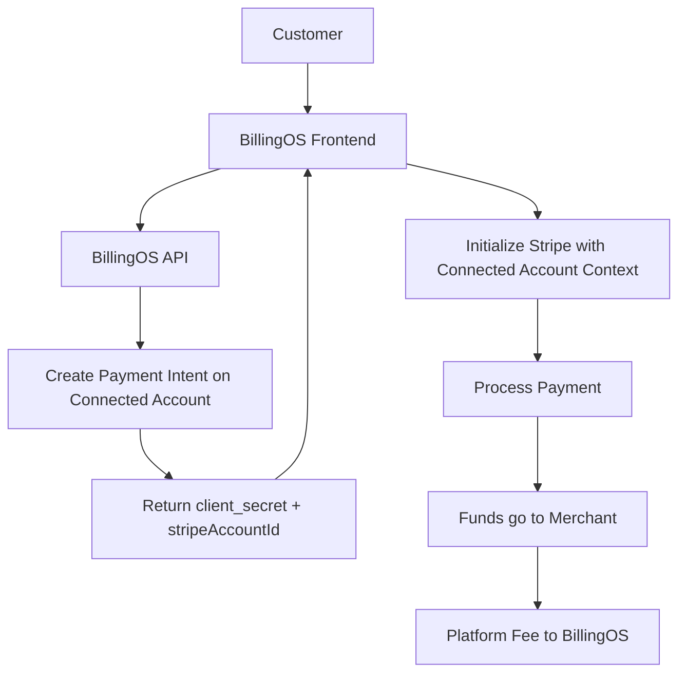

# Stripe Connected Accounts Payment Flow - Implementation & Fix

## Issue Summary

**Problem**: The client_secret provided does not match any associated PaymentIntent on this account.

**Root Cause**: Payment intents were being created on the connected (merchant) account, but the frontend was using the platform's publishable key without the connected account context.

## The Connected Accounts Architecture

### How It Works

1. **Platform Account**: BillingOS's main Stripe account
2. **Connected Accounts**: Each merchant/organization has their own Stripe account connected to BillingOS
3. **Direct Charges**: Payments are created directly on the merchant's account with platform fees

### Payment Flow



## The Fix Applied

### Before (Incorrect)
```typescript
// CheckoutForm.tsx - Line 13-14
const stripePromise = loadStripe(
  process.env.NEXT_PUBLIC_STRIPE_PUBLISHABLE_KEY!
)
```

This initialization used only the platform's publishable key, which cannot access payment intents created on connected accounts.

### After (Correct)
```typescript
// CheckoutForm.tsx - Updated
const stripePromise = useMemo(() => {
  const publishableKey = process.env.NEXT_PUBLIC_STRIPE_PUBLISHABLE_KEY!

  if (session.stripeAccountId) {
    // For connected accounts, pass the account ID
    return loadStripe(publishableKey, {
      stripeAccount: session.stripeAccountId
    })
  }

  // Fallback for platform-level charges
  return loadStripe(publishableKey)
}, [session.stripeAccountId])
```

This properly initializes Stripe with the connected account context when available.

## Key Components

### 1. Backend - Payment Intent Creation
**File**: `apps/api/src/v1/checkout/checkout.service.ts`

```typescript
// Creates payment intent on connected account
const paymentIntent = await this.stripeService.getClient().paymentIntents.create({
  amount,
  currency,
  customer: stripeCustomerId,
  application_fee_amount: applicationFeeAmount, // Platform fee
  // ... other params
}, {
  stripeAccount: stripeAccountId // Critical: Specifies connected account
});
```

### 2. Backend - Returning Account ID
**File**: `apps/api/src/v1/checkout/checkout.service.ts`

```typescript
return {
  id: checkoutSession.id,
  clientSecret: paymentIntent.client_secret!,
  stripeAccountId, // Included in response
  // ... other fields
};
```

### 3. Frontend - Using Account Context
**File**: `apps/web/src/app/embed/checkout/[sessionId]/components/CheckoutForm.tsx`

The frontend now properly uses the `stripeAccountId` when initializing Stripe Elements.

## Testing the Fix

### Manual Testing
1. Create a checkout session through the SDK
2. Verify the payment form loads without errors
3. Complete a test payment
4. Check that funds appear in the connected account (minus platform fee)

### Using the Test Script
```bash
# Run the test script
node test-connected-account.js
```

The script will:
- Create a checkout session
- Verify the connected account ID is present
- Validate all required fields
- Provide clear feedback on the setup

## Platform Fees

The implementation includes platform fees:
- **Application Fee**: 5% of transaction (configurable)
- **Calculation**: `Math.round(amount * 0.05)`
- **Applied via**: `application_fee_amount` parameter

## Security Considerations

1. **Account ID Exposure**: The connected account ID is not sensitive and can be exposed to the frontend
2. **Client Secret**: Remains secure, only used for the specific payment
3. **Platform Control**: BillingOS maintains control through the platform account

## Alternative Approaches (Not Used)

### 1. Destination Charges
- Charge on platform account, transfer to connected account
- Platform has more liability for refunds/disputes
- Requires changes to payment intent creation

### 2. Separate Charges and Transfers
- Most complex implementation
- Maximum control but delayed payouts
- Not suitable for real-time checkout

### 3. Stripe Checkout (Like Autum)
- Uses Stripe-hosted pages
- Simpler but less control
- Doesn't fit the embedded iframe strategy

## Troubleshooting

### Common Issues

1. **"Invalid account" error**
   - Verify the organization has a connected Stripe account
   - Check `accounts.stripe_id` in database

2. **Payment fails to process**
   - Ensure connected account is fully onboarded
   - Check account status in Stripe dashboard

3. **No stripe_account_id in response**
   - Organization might not have a connected account
   - Check the `accounts` table join in the query

### Debug Checklist

- [ ] Organization has a connected Stripe account
- [ ] Account status is 'active' or 'complete'
- [ ] Frontend receives `stripeAccountId` in session data
- [ ] Stripe is initialized with connected account context
- [ ] Platform fees are configured correctly

## Best Practices

1. **Always check for connected account**: Fallback to platform charges if needed
2. **Log account IDs**: For debugging payment issues
3. **Monitor webhooks**: Set up webhooks for both platform and connected accounts
4. **Test thoroughly**: Use Stripe test mode with test connected accounts

## References

- [Stripe Direct Charges Documentation](https://docs.stripe.com/connect/direct-charges)
- [Stripe Elements with Connected Accounts](https://docs.stripe.com/connect/direct-charges?platform=web&ui=embedded-form)
- [Platform Fees Guide](https://docs.stripe.com/connect/collect-fees)

## Implementation Status

✅ **Completed**:
- Backend creates payment intents on connected accounts
- Backend returns `stripeAccountId` in checkout session
- Frontend updated to use connected account context
- Platform fees properly configured

🔄 **Next Steps**:
- Add webhook handling for connected account events
- Implement reconciliation for platform fees
- Add dashboard for merchants to view their transactions
- Consider adding support for destination charges as an option