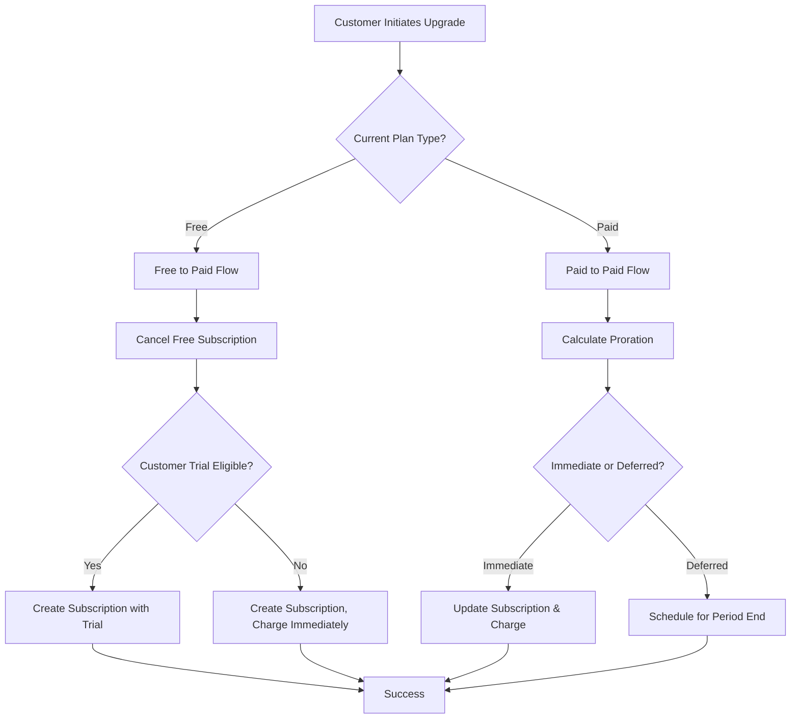
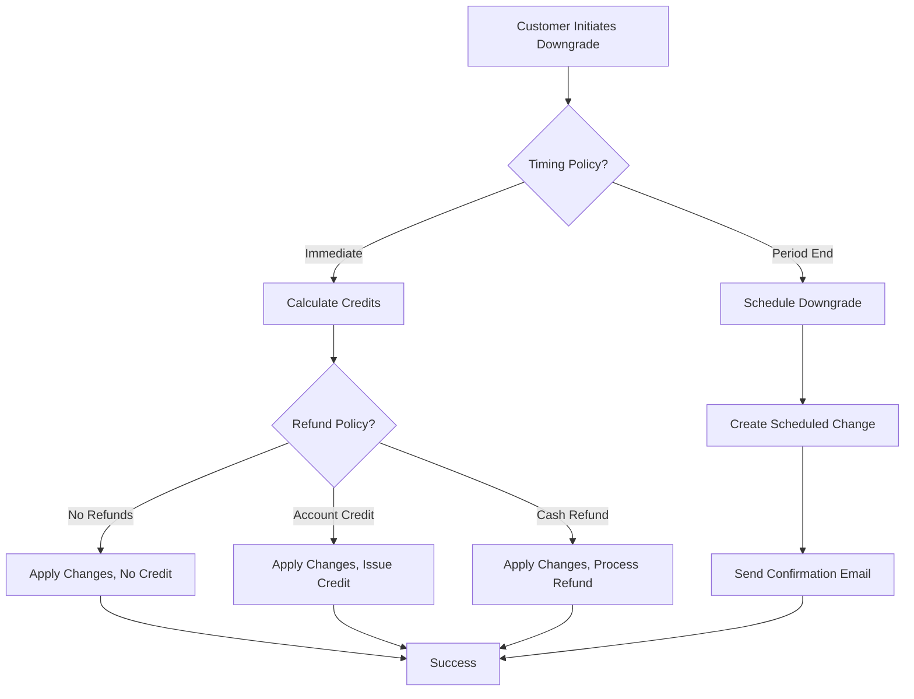

# Subscription Upgrade/Downgrade Plan

## Executive Summary

This document outlines the implementation plan for subscription upgrade and downgrade functionality in BillingOS. The feature will allow customers to change their subscription plans, with proper proration, billing adjustments, and merchant-configurable policies.

## Table of Contents
1. [Research & Analysis](#research--analysis)
2. [Implementation Approach](#implementation-approach)
3. [Phase 1: MVP Implementation](#phase-1-mvp-implementation)
4. [Phase 2: Enhanced Features](#phase-2-enhanced-features)
5. [Phase 3: Advanced Configuration](#phase-3-advanced-configuration)
6. [Technical Specifications](#technical-specifications)
7. [Database Schema](#database-schema)
8. [API Design](#api-design)
9. [Business Logic & Rules](#business-logic--rules)
10. [Edge Cases](#edge-cases)

## Research & Analysis

### Autumn's Approach (Complex, Enterprise-Ready)

**Architecture:**
- Multi-phase billing orchestration (setup → compute → execute)
- Granular proration configuration per product/feature
- Support for custom pricing during upgrades
- Product versioning for grandfathering old subscriptions

**Proration Options:**
- **On Upgrade:** `BillImmediately`, `ProrateImmediately`, `ProrateNextCycle`, `BillNextCycle`
- **On Downgrade:** `Prorate`, `None`, `NoProrations`
- Configurable per product line item

**Key Features:**
- Version management for products
- Multi-entity support in single operation
- Custom plan creation during upgrade
- Configurable refund behaviors

### Flowglad's Approach (Simple, Fair-Value Based)

**Architecture:**
- Direct transaction-based operations
- Focus on "fair value" calculation
- Single adjustment endpoint with timing options
- Simpler state management

**Proration Method:**
```typescript
// Fair Value = What customer should pay for the period
oldPlanValue = oldPrice × percentThroughPeriod
newPlanValue = newPrice × (1 - percentThroughPeriod)
totalFairValue = oldPlanValue + newPlanValue
amountDue = max(0, totalFairValue - alreadyPaid)
```

**Key Features:**
- Automatic free plan cancellation on paid upgrade
- Billing cycle preservation options
- Never issues cash refunds (account credit only)
- Simpler edge case handling

### Stripe's Official Recommendations

1. **Default to Proration**: Most fair for customers
2. **Use Subscription Schedules**: For complex timing requirements
3. **Preview Before Execute**: Always show charges upfront
4. **Handle Webhooks**: React to `customer.subscription.updated` events
5. **Idempotency**: Use idempotency keys for retry safety

### Industry Best Practices

- **80% of SaaS** use immediate upgrade with proration
- **Downgrades** typically process at period end (no refunds)
- **Free trials** often continue on upgraded plans
- **Preview is mandatory** for trust and transparency

## Implementation Approach

### Phased Rollout Strategy

We'll implement in three phases to balance speed-to-market with feature completeness:

1. **Phase 1 (MVP)**: Basic upgrade/downgrade with fixed rules
2. **Phase 2 (Enhanced)**: Organization-level configuration
3. **Phase 3 (Advanced)**: Per-product configuration and complex scenarios

### Why This Approach?

- **Faster Time to Market**: Ship Phase 1 in 2-3 weeks
- **Learn from Usage**: Gather feedback before building complexity
- **Reduced Risk**: Test core functionality before advanced features
- **Progressive Enhancement**: Each phase builds on the previous

## Phase 1: MVP Implementation

### Scope
- Immediate upgrades with proration
- Downgrades at period end (no refunds)
- Free to paid upgrades with trial
- Fixed rules for all organizations

### Components

#### 1. Backend Service
**File**: `apps/api/src/subscriptions/subscription-upgrade.service.ts`

**Core Methods:**
```typescript
class SubscriptionUpgradeService {
  // Preview upgrade costs and proration
  async previewUpgrade(subscriptionId: string, newPriceId: string): PreviewResult

  // Execute the upgrade/downgrade
  async changeSubscriptionPlan(subscriptionId: string, newPriceId: string): Subscription

  // Calculate proration amounts
  private calculateProration(current: Subscription, newPrice: Price): ProrationResult

  // Handle free to paid upgrade
  private upgradeFromFree(customerId: string, priceId: string): Subscription

  // Schedule downgrade for period end
  private scheduleDowngrade(subscriptionId: string, newPriceId: string): ScheduledChange
}
```

#### 2. API Endpoints
**File**: `apps/api/src/subscriptions/subscriptions.controller.ts`

```typescript
// Preview plan change
POST /api/v1/subscriptions/:id/preview-change
Body: { newPriceId: string }
Response: {
  proratedCredit: number,
  immediateCharge: number,
  nextPeriodCharge: number,
  effectiveDate: string
}

// Execute plan change
POST /api/v1/subscriptions/:id/change-plan
Body: { newPriceId: string, confirmAmount?: number }
Response: { subscription: Subscription, invoice?: Invoice }

// Get available upgrade/downgrade options
GET /api/v1/subscriptions/:id/available-plans
Response: { currentPlan: Plan, availablePlans: Plan[], restrictions: string[] }
```

#### 3. Frontend Components

**Subscription Management Page:**
`apps/web/src/app/dashboard/[organization]/billing/subscriptions/page.tsx`
- Display current subscription
- "Change Plan" button
- Show upgrade/downgrade options

**Plan Change Modal:**
`apps/web/src/components/Subscriptions/PlanChangeModal.tsx`
- Show current vs new plan comparison
- Display proration preview
- Confirmation button with amount
- Success/error handling

#### 4. Proration Calculation

```typescript
function calculateProration(
  currentPrice: number,
  newPrice: number,
  billingInterval: 'month' | 'year',
  periodStart: Date,
  periodEnd: Date,
  changeDate: Date
): ProrationResult {
  const totalDays = daysBetween(periodStart, periodEnd);
  const usedDays = daysBetween(periodStart, changeDate);
  const remainingDays = totalDays - usedDays;

  const unusedValue = (currentPrice * remainingDays) / totalDays;
  const newPlanCost = (newPrice * remainingDays) / totalDays;

  return {
    credit: Math.round(unusedValue),
    charge: Math.round(newPlanCost),
    netAmount: Math.round(newPlanCost - unusedValue)
  };
}
```

### Phase 1 Business Rules

#### Upgrades (Lower → Higher Price)
- **Timing**: Immediate
- **Billing**: Charge prorated difference today
- **Trial Handling**: Preserve trial if active
- **Invoice**: Generate immediately

#### Downgrades (Higher → Lower Price)
- **Timing**: End of current period
- **Billing**: No refund, keep current plan until period end
- **Notification**: Email about pending change
- **Cancellable**: User can cancel pending downgrade

#### Free → Paid
- **Cancel Free**: Automatically cancel free subscription
- **Trial**: Apply product's trial period if eligible
- **Start Date**: Immediate
- **First Charge**: After trial ends (if applicable)

## Phase 2: Enhanced Features

### Scope
- Organization-level billing settings
- Account credit system
- Upgrade/downgrade history
- Email notifications

### New Components

#### 1. Organization Billing Settings
**Database Table**: `organization_billing_settings`
```sql
- upgrade_timing: 'immediate' | 'period_end' | 'customer_choice'
- downgrade_timing: 'immediate' | 'period_end'
- proration_enabled: boolean
- refund_policy: 'no_refunds' | 'account_credit' | 'cash_refund'
- trial_on_upgrade: boolean
```

#### 2. Credit System
**Database Table**: `account_credits`
```sql
- organization_id: UUID
- amount: INTEGER
- currency: VARCHAR
- reason: VARCHAR
- source_transaction_id: UUID
- expires_at: TIMESTAMPTZ
```

#### 3. Subscription Change History
**Database Table**: `subscription_changes`
```sql
- subscription_id: UUID
- change_type: 'upgrade' | 'downgrade' | 'cancel'
- from_plan: JSONB
- to_plan: JSONB
- proration_amount: INTEGER
- effective_date: TIMESTAMPTZ
```

### Phase 2 Business Rules

#### Merchant Configuration
- Merchants can choose upgrade/downgrade timing
- Option to disable proration
- Configure refund policies
- Set trial behavior on upgrades

#### Customer Experience
- See both immediate and deferred options (if merchant allows)
- View credit balance
- Access change history
- Cancel pending changes

## Phase 3: Advanced Configuration

### Scope
- Per-product proration settings
- Quantity-based changes (seats)
- Usage-based billing adjustments
- Complex scheduling scenarios
- Grandfathered pricing

### Advanced Features

#### 1. Per-Product Configuration
```typescript
interface ProductBillingConfig {
  upgradeProration: 'none' | 'immediate' | 'next_cycle';
  downgradeProration: 'none' | 'credit' | 'refund';
  allowDowngrade: boolean;
  allowQuantityChange: boolean;
  minimumQuantity?: number;
  maximumQuantity?: number;
}
```

#### 2. Quantity Changes
- Support seat/license quantity adjustments
- Prorate quantity changes
- Enforce min/max limits
- Bundle pricing tiers

#### 3. Grandfathering
- Keep customers on old product versions
- Prevent upgrades to products they shouldn't access
- Custom migration paths

## Technical Specifications

### Stripe Integration

#### Subscription Update
```typescript
await stripe.subscriptions.update(subscriptionId, {
  items: [{
    id: subscriptionItemId,
    price: newPriceId,
  }],
  proration_behavior: 'create_prorations',
  proration_date: Math.floor(Date.now() / 1000),
  billing_cycle_anchor: 'unchanged',
});
```

#### Preview with Upcoming Invoice
```typescript
const preview = await stripe.invoices.retrieveUpcoming({
  subscription: subscriptionId,
  subscription_items: [{
    id: subscriptionItemId,
    price: newPriceId,
  }],
  subscription_proration_behavior: 'create_prorations',
});
```

### Webhook Handling

**Events to Handle:**
- `customer.subscription.updated` - Track plan changes
- `invoice.created` - Proration invoices
- `invoice.payment_succeeded` - Confirm upgrade payment
- `invoice.payment_failed` - Revert failed upgrades
- `customer.subscription.deleted` - Handle cancellations

### State Management

**Subscription States During Change:**
1. `active` - Normal state
2. `pending_change` - Change scheduled for period end
3. `upgrading` - Processing immediate upgrade
4. `past_due` - Payment failed on upgrade

## Database Schema

### Core Tables

#### subscription_changes
```sql
CREATE TABLE subscription_changes (
  id UUID PRIMARY KEY DEFAULT gen_random_uuid(),
  subscription_id UUID REFERENCES subscriptions(id),
  organization_id UUID REFERENCES organizations(id),
  change_type VARCHAR(50) NOT NULL, -- 'upgrade', 'downgrade', 'cancel', 'reactivate'
  from_price_id UUID REFERENCES product_prices(id),
  to_price_id UUID REFERENCES product_prices(id),
  from_amount INTEGER,
  to_amount INTEGER,
  proration_credit INTEGER,
  proration_charge INTEGER,
  net_amount INTEGER,
  status VARCHAR(50) DEFAULT 'pending', -- 'pending', 'processing', 'completed', 'failed', 'scheduled'
  scheduled_for TIMESTAMPTZ,
  completed_at TIMESTAMPTZ,
  failed_reason TEXT,
  stripe_invoice_id VARCHAR(255),
  metadata JSONB,
  created_at TIMESTAMPTZ DEFAULT NOW(),
  updated_at TIMESTAMPTZ DEFAULT NOW()
);

CREATE INDEX idx_subscription_changes_subscription ON subscription_changes(subscription_id);
CREATE INDEX idx_subscription_changes_status ON subscription_changes(status);
CREATE INDEX idx_subscription_changes_scheduled ON subscription_changes(scheduled_for) WHERE status = 'scheduled';
```

#### organization_billing_settings (Phase 2)
```sql
CREATE TABLE organization_billing_settings (
  id UUID PRIMARY KEY DEFAULT gen_random_uuid(),
  organization_id UUID UNIQUE REFERENCES organizations(id),
  upgrade_timing VARCHAR(50) DEFAULT 'immediate',
  downgrade_timing VARCHAR(50) DEFAULT 'period_end',
  proration_enabled BOOLEAN DEFAULT true,
  refund_policy VARCHAR(50) DEFAULT 'no_refunds',
  allow_immediate_downgrade BOOLEAN DEFAULT false,
  trial_on_paid_upgrade BOOLEAN DEFAULT true,
  metadata JSONB,
  created_at TIMESTAMPTZ DEFAULT NOW(),
  updated_at TIMESTAMPTZ DEFAULT NOW()
);
```

#### account_credits (Phase 2)
```sql
CREATE TABLE account_credits (
  id UUID PRIMARY KEY DEFAULT gen_random_uuid(),
  organization_id UUID REFERENCES organizations(id),
  customer_id UUID REFERENCES customers(id),
  amount INTEGER NOT NULL, -- in cents
  currency VARCHAR(3) NOT NULL,
  balance INTEGER NOT NULL, -- remaining balance
  reason VARCHAR(255),
  source_type VARCHAR(50), -- 'downgrade', 'refund', 'promotion', 'manual'
  source_id UUID, -- reference to subscription_change, refund, etc.
  expires_at TIMESTAMPTZ,
  created_at TIMESTAMPTZ DEFAULT NOW(),
  updated_at TIMESTAMPTZ DEFAULT NOW()
);

CREATE INDEX idx_account_credits_organization ON account_credits(organization_id);
CREATE INDEX idx_account_credits_customer ON account_credits(customer_id);
CREATE INDEX idx_account_credits_expires ON account_credits(expires_at) WHERE expires_at IS NOT NULL;
```

## API Design

### RESTful Endpoints

#### Phase 1 Endpoints

```yaml
# Preview plan change
POST /api/v1/subscriptions/{subscriptionId}/preview-change
Request:
  newPriceId: string
  effectiveDate?: string # 'immediate' | 'period_end'
Response:
  currentPlan:
    name: string
    amount: number
    interval: string
  newPlan:
    name: string
    amount: number
    interval: string
  proration:
    unusedCredit: number
    newPlanCharge: number
    immediatePayment: number
  effectiveDate: string
  nextBillingDate: string

# Execute plan change
POST /api/v1/subscriptions/{subscriptionId}/change-plan
Request:
  newPriceId: string
  confirmAmount: number # Must match preview for safety
  effectiveDate?: string
Response:
  subscription: Subscription
  change: SubscriptionChange
  invoice?: Invoice # If immediate payment

# Get available plans
GET /api/v1/subscriptions/{subscriptionId}/available-plans
Response:
  currentPlan: Plan
  availableUpgrades: Plan[]
  availableDowngrades: Plan[]
  restrictions: string[] # Reasons why some plans aren't available
```

#### Phase 2 Additional Endpoints

```yaml
# Get/Update organization billing settings
GET /api/v1/organizations/{orgId}/billing-settings
PATCH /api/v1/organizations/{orgId}/billing-settings

# Credit management
GET /api/v1/organizations/{orgId}/credits
POST /api/v1/organizations/{orgId}/credits/apply

# Change history
GET /api/v1/subscriptions/{subscriptionId}/changes
DELETE /api/v1/subscription-changes/{changeId} # Cancel scheduled change
```

### SDK Methods

```typescript
// BillingOS SDK
const billingOS = new BillingOS(apiKey);

// Preview upgrade
const preview = await billingOS.subscriptions.previewChange(subscriptionId, {
  newPriceId: 'price_abc123',
  effectiveDate: 'immediate'
});

// Execute upgrade
const result = await billingOS.subscriptions.changePlan(subscriptionId, {
  newPriceId: 'price_abc123',
  confirmAmount: preview.proration.immediatePayment
});

// Get available plans
const plans = await billingOS.subscriptions.getAvailablePlans(subscriptionId);
```

## Business Logic & Rules

### Upgrade Logic Flow



### Downgrade Logic Flow



### Proration Rules

#### Standard Proration (Monthly)
```
Example: $50/mo → $100/mo on day 10 of 30-day month

Days Used: 10
Days Remaining: 20
Unused Credit: $50 × (20/30) = $33.33
New Plan Cost: $100 × (20/30) = $66.67
Amount Due Today: $66.67 - $33.33 = $33.34
```

#### Annual Proration
```
Example: $500/yr → $1000/yr on month 4 of 12

Months Used: 4
Months Remaining: 8
Unused Credit: $500 × (8/12) = $333.33
New Plan Cost: $1000 × (8/12) = $666.67
Amount Due Today: $666.67 - $333.33 = $333.34
```

#### No Proration (Phase 2+)
- Charge full amount immediately
- Or wait until next period
- Based on merchant configuration

## Edge Cases

### Complex Scenarios to Handle

#### 1. Multiple Changes in Same Period
**Scenario**: Customer upgrades twice in one month
**Solution**: Track all changes, compound proration calculations
```typescript
changes = getChangesInCurrentPeriod(subscriptionId);
totalCredit = sum(changes.map(c => c.credit));
finalCharge = newPlanCost - totalCredit;
```

#### 2. Upgrade During Trial
**Scenario**: Free trial user upgrades to higher plan
**Options**:
- Keep trial on new plan
- End trial and charge immediately
- Extend trial period
**Decision**: Keep trial (most customer-friendly)

#### 3. Downgrade with Pending Invoice
**Scenario**: Customer downgrades with unpaid invoice
**Solution**:
- Block downgrade until payment
- Or allow but don't apply credits

#### 4. Plan No Longer Available
**Scenario**: Customer tries to change to discontinued plan
**Solution**:
- Block change with clear message
- Offer similar alternatives
- Allow if grandfathered

#### 5. Currency Mismatch
**Scenario**: Switching between plans in different currencies
**Solution**:
- Block change
- Or convert at current exchange rate
**Decision**: Block (simpler, avoids exchange rate issues)

#### 6. Quantity and Plan Change Together
**Scenario**: Upgrade plan AND add seats simultaneously
**Solution**: Calculate separately, show breakdown:
```typescript
planProration = calculatePlanChange(old, new);
quantityProration = calculateQuantityChange(oldQty, newQty);
total = planProration + quantityProration;
```

#### 7. Failed Payment on Upgrade
**Scenario**: Upgrade payment fails
**Solution**:
- Revert to original plan
- Retry payment with exponential backoff
- Send payment update request
- After X failures, cancel upgrade

#### 8. Refund After Upgrade
**Scenario**: Customer upgrades then requests refund
**Solution**:
- Prorate refund based on usage
- Revert to original plan
- Apply refund as credit (not cash)

### Race Conditions

#### Concurrent Modifications
**Problem**: Two upgrade requests at same time
**Solution**: Database-level locking
```sql
SELECT * FROM subscriptions WHERE id = ? FOR UPDATE;
```

#### Webhook vs API State
**Problem**: Stripe webhook arrives before API response
**Solution**: Idempotency keys and state reconciliation

## Success Metrics

### Phase 1 Metrics
- **Upgrade Completion Rate**: > 80%
- **Proration Accuracy**: 100%
- **Support Tickets**: < 5% of upgrades
- **Preview-to-Completion**: > 60%
- **Time to Complete**: < 3 weeks

### Phase 2 Metrics
- **Merchant Adoption**: > 30% customize settings
- **Credit Utilization**: > 70% of issued credits used
- **Customer Satisfaction**: > 4.5/5 on upgrade flow

### Phase 3 Metrics
- **Complex Plan Adoption**: > 10% use per-product settings
- **Quantity Change Usage**: > 20% of upgrades include quantity
- **Grandfathering Success**: < 1% forced migrations

## Implementation Timeline

### Phase 1: MVP (4 weeks)
- Week 1: Backend service + proration logic
- Week 2: API endpoints + Stripe integration
- Week 3: Frontend UI + preview modal
- Week 4: Testing + webhook handling

### Phase 2: Enhanced (6 weeks)
- Week 1-2: Database schema + settings API
- Week 3-4: Credit system + history tracking
- Week 5: UI for merchant settings
- Week 6: Testing + migration

### Phase 3: Advanced (8 weeks)
- Week 1-2: Per-product configuration system
- Week 3-4: Quantity change support
- Week 5-6: Grandfathering + versioning
- Week 7-8: Complex scenarios + testing

## References

### External Documentation
- [Stripe Subscription Upgrades/Downgrades](https://stripe.com/docs/billing/subscriptions/upgrade-downgrade)
- [Stripe Proration](https://stripe.com/docs/billing/subscriptions/prorations)
- [Stripe Subscription Schedules](https://stripe.com/docs/billing/subscriptions/subscription-schedules)

### Internal References
- Autumn codebase: `/Users/ankushkumar/Code/autumn`
- Flowglad codebase: `/Users/ankushkumar/Code/flowglad`
- BillingOS Products: `/docs/products/`
- BillingOS Subscriptions: `/docs/subscriptions/`

## Appendix

### Glossary
- **Proration**: Calculating partial charges/credits based on time used
- **Fair Value**: Total amount customer should pay for a billing period
- **Grandfathering**: Keeping customers on old plans/pricing
- **Billing Anchor**: The day of month/year when billing recurs
- **Scheduled Change**: Plan change set to occur at future date

### Decision Log
1. **Default to Immediate Upgrades**: Industry standard, most fair
2. **No Cash Refunds on Downgrade**: Reduces complexity, standard practice
3. **Trial on Free→Paid**: Encourages upgrades, reduces friction
4. **Phase Approach**: Ship faster, learn from usage, reduce risk